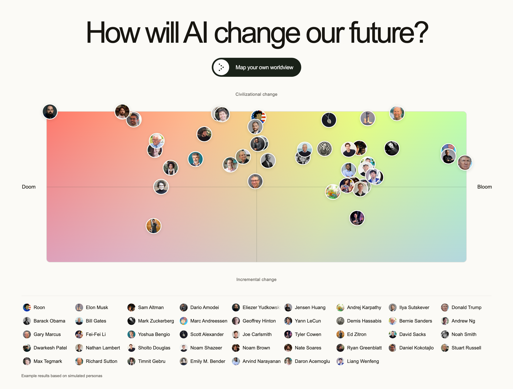
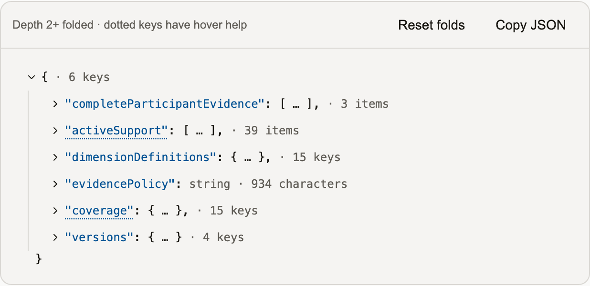
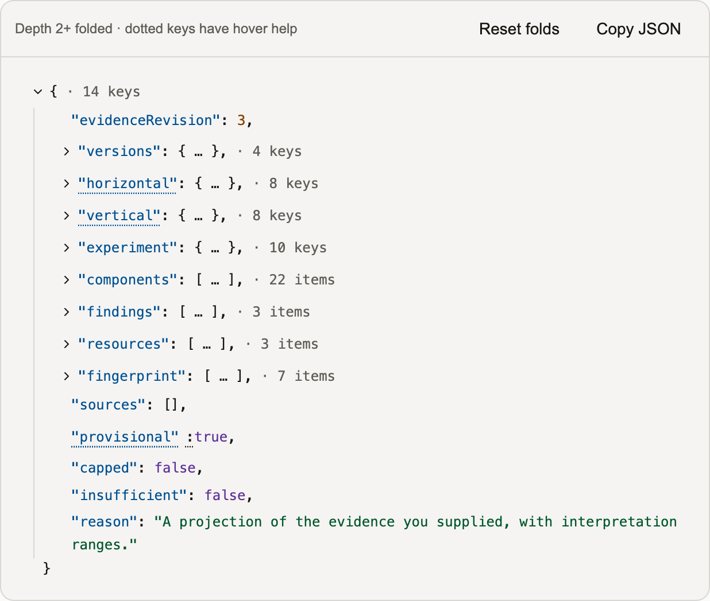

[](https://www.doom-or-bloom.com)

# Doom or Bloom

**How will AI change our future?** Explore the range of views, then map your own through a few open-ended questions. No jargon, account, or predetermined camp required.

[**Explore the map →**](https://www.doom-or-bloom.com) · [**Map your own worldview →**](https://www.doom-or-bloom.com/assessment)

## Why build this?

AI’s potential upsides and risks deserve more than slogans. As capabilities advance and decisions become more consequential, we need accessible tools for grounded, truth-seeking discussion across very different views.

I built this to explore the field’s voices and help people untangle conflicting intuitions. It has already sharpened my own views. The aim is to represent yours faithfully, with as little editorial steering as possible.

## An interview that follows your thinking

Start with **“What do you think AI means for our future—and why?”** The engine interprets your answer, identifies what remains unclear, and selects the authored follow-up most likely to add useful information with the least repetition and effort.

Results unlock with enough supported coverage, potentially after one detailed answer; most interviews last between 3-5 questions. Your results link back to your answers, preserving uncertainty and salient excerpts used as evidence.

## Powered by TypeSafe’s Jev

[Jev](https://docs.typesafe.ai/introduction) is the core inference component. It evaluates many small, typed questions against shared context: **Choice** for categories, **Score** for rubric levels, and **Noul** for probability judgments.

We use those judgments to interpret answers, compare candidate follow-ups, and build a worldview profile. TypeScript owns the routing rules, stopping conditions, calculations, and presentation. Questions and result prose are authored; Jev supplies structured judgments.

Batching judgments over shared state and reusing unchanged results keeps inference economical. Adaptive interviewing is a compelling fit: many narrow decisions, composed into an accessible experience at scale.

| State supplied to Jev | Result assembled from its judgments |
| --- | --- |
| [](docs/images/jev-state.png) | [](docs/images/jev-result.png) |

Recorded simulated assessment; the result includes application calculations, not just raw Jev output. [Inference architecture](docs/TYPESAFE.md).

## Simulated people, real sources

The featured personas are simulations grounded in linked public statements, essays, and interviews. A separate model answers the actual interview questions from those source briefs; the normal assessment engine evaluates the answers without being given a target position.

These journeys help refine Jev rubrics and routing logic and catch regressions. They are useful development cases—not statements made by those people, endorsements, or independently validated assessments. [Explore the persona workflow](docs/user-journeys.md).

## The map is not the territory

We model eight worldview dimensions: capabilities and timelines, transition speed, benefits, harms, controllability, institutions, human agency, and action. Seven additional dimensions describe the reasoning expressed in the answers, from causal clarity to willingness to update.

Jev interprets these against explicit definitions. Code turns the supported judgments into a profile; the headline map shows **overall outlook × expected transformation**, with further views available below it. Two coordinates cannot capture a whole worldview.

This is an experimental model, not a forecast of what will happen or a measure of someone’s intelligence. Interpretation confidence is not the probability that a belief is true. Participant answers are not independently fact-checked, and the rubric and readiness thresholds still need broader validation. [Read the methodology](docs/ASSESSMENT.md).

## Privacy

No accounts. No persistent answer database. Your answers, drafts, and results stay in browser storage so you can return later. Submitted answers pass through our server to Jev for evaluation; a temporary server retry cache expires after two minutes. TypeSafe’s own data policies apply to its processing.

Optional analytics exclude answer text. Debug traces, when enabled, also stay in your browser. The checked-in persona data is generated development material, not visitor transcripts. [Privacy details](https://www.doom-or-bloom.com/privacy).

## Run locally

Requires **Node.js 24+**, **pnpm**, and a **TypeSafe API key** for live assessments.

```sh
pnpm install --frozen-lockfile
cp .env.example .env.local
# Set TYPESAFE_API_KEY in .env.local
pnpm dev
```

Open the Portless URL printed by the server. For keyless UI development, set `ASSESSMENT_PROVIDER=fixture`. See [CONTRIBUTING.md](CONTRIBUTING.md) for environment variables, checks, and persona tooling.

Built with **Next.js, React, TypeScript, the TypeSafe SDK, Tailwind CSS, and shadcn/ui**. The main places to explore:

- [`lib/server/engine.ts`](lib/server/engine.ts): adaptive interview orchestration.
- [`lib/assessment/`](lib/assessment/): state, readiness, and projections.
- [`content/`](content/): authored questions, rubrics, and source material.
- [`lib/journeys/`](lib/journeys/): persona simulations and regression workflows.
- [`app/`](app/) and [`components/`](components/): pages, maps, and inspection UI.

## What’s next?

A future Socratic mode could challenge assumptions, introduce well-sourced counterexamples, and help strengthen your reasoning. This MVP first focuses on understanding your views without trying to change them.

The goal is clear-thinking tools that need no specialist background. Feedback from across the AI-futures spectrum is welcome—especially where an interpretation feels wrong or a question misses the point. [Share feedback](https://github.com/transitive-bullshit/doom-or-bloom/issues).
