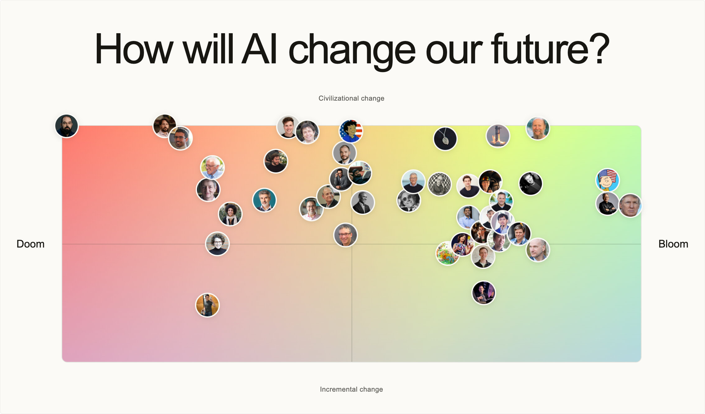

# Doom or Bloom

**How will AI change our future?** Explore the range of views, then map your own through a few open-ended questions. No jargon, account, or predetermined camp required.

[**Explore the map →**](https://www.doom-or-bloom.com) · [**Map your own worldview →**](https://www.doom-or-bloom.com/assessments?start=1)

## An interview that follows your thinking

Start with **“What do you think AI means for our future—and why?”** Each follow-up helps clarify your perspective. Results may be ready after one detailed answer; most interviews take just a few questions.

See where you land, compare nearby worldviews, and explore the answers behind your results. The aim is to understand your views without trying to change them.

## Simulated people, real sources

Featured personas are simulations grounded in linked public statements, essays, and interviews—not those people’s actual answers or endorsements.

## The map is not the territory

The map pairs your **Doom–Bloom outlook × expected transformation**. Two coordinates cannot capture a whole worldview. Interpretation ranges reflect uncertainty about your answers, not the probability that your beliefs are true.

This is an experiment, not a validated forecast or an intelligence test. Mixed views and uncertainty belong here. [About the project](https://www.doom-or-bloom.com/about).

## Private unless you publish

Your answers and results remain private unless you choose to publish them. No sign-up is required. [Privacy policy](https://www.doom-or-bloom.com/privacy).

## Contribute

Feedback is welcome—especially where an interpretation feels wrong or a question misses the point. [Share feedback](https://github.com/transitive-bullshit/doom-or-bloom/issues).

For local setup and checks, see [CONTRIBUTING.md](CONTRIBUTING.md). For architecture and methodology, see [the docs](docs/README.md).

## License

[MIT](license) by [Travis Fischer](https://x.com/transitive_bs)
