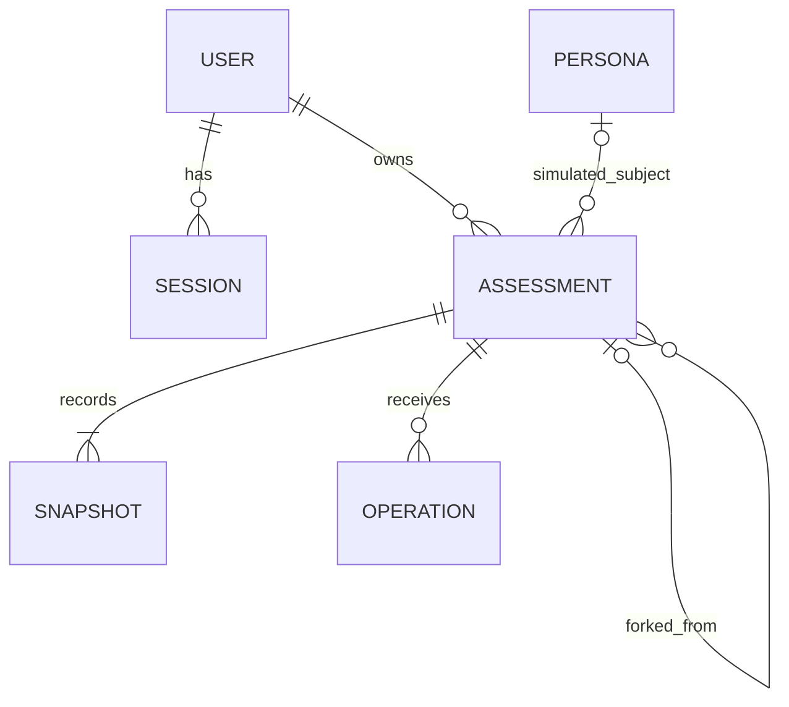

# Persistent assessments — approved design

Status: approved on 2026-09-23; participant persistence, forks, and publication implemented; persona/account checkpoints pending. [The implementation plan](persistence-implementation-plan.md) tracks delivery and validation. This document supersedes the browser-only persistence, no-account, destructive-restart, and generic-only sharing restrictions in the original MVP handoff. The implementation plan records remaining acceptance checks and the separate persona/account work.

## Product behavior

Keep starting an assessment as fast as it is today. Neither registration nor an assessment-management screen belongs in the first-run path.

| Entry/action | Behavior |
| --- | --- |
| Main “Map your worldview” CTA; owner has zero assessments | Establish an anonymous session, create one private assessment, navigate directly to `/assessment/<id>` with the first prompt ready. |
| Same CTA; owner already has any assessments | Navigate to `/assessments`, whether there is one draft, multiple drafts, or only completed assessments. Do not choose a draft for the participant. |
| “My assessments” | Open the owner's library. An empty library may offer New assessment; the main CTA bypasses it. |
| Explicit New assessment | Create a new private assessment and navigate to it, preserving existing assessments. |
| View my results | Preview the current result; the assessment remains open. |
| Done | Finish the assessment without requiring publication. |
| Share | Explain once that the full submitted conversation and inferred results become public; finish and publish atomically. No account requirement. |
| Continue on an open assessment | Continue the existing interview. |
| Continue on a completed assessment | “Continue in a new assessment” creates a private fork, then continues or asks the selected clarification. |
| Make private | Remove public access; the completed content remains frozen. |
| Delete | Delete this assessment and its snapshots, operations, and retained failure diagnostics. Independent forks remain. |

Creation uses an explicit mutation triggered by the CTA, not a side effect of rendering, prefetching, a crawler visit, or a GET. Establish the session before assessment creation; serialize the empty-library check and creation for that owner. Reuse a request key on uncertain retries. Loading and error states retain the CTA's one-click flow.

The public/private distinction is separate from operator access. Submitted answers, rejected replies, results, and bounded failure information are retained indefinitely unless the assessment is deleted. Operators may inspect private assessments to improve the product. Explain this before the first submission and in privacy documentation. Unsubmitted typing stays local, keyed by assessment; it is not uploaded for analysis.

The first interview permits 12 issued prompts. A fork permits up to 12 additional prompts, with an absolute maximum of 30 across the inherited conversation. Compute the fork ceiling as `min(inheritedPromptCount + 12, 30)`. Skipped and clarification prompts count as issued prompts; recovery attempts on the same prompt do not. Warn two prompts before the applicable ceiling. At a ceiling, finalize honestly even when evidence is insufficient; at 30, offer a fresh assessment rather than a fork that cannot continue. Readiness can still end the interview much earlier.

## Identity, routes, and access

Better Auth supplies anonymous users and persistent sessions in milestone one. X OAuth is the only interactive login provider in milestone two. A provider account and an assessment owner are separate concepts: an anonymous owner has no X account yet.

- Establish anonymous identity lazily when a participant starts, not for every landing-page visitor. Use Better Auth session cookies, with HttpOnly, appropriate SameSite, production Secure, origin protection, and a deliberately configured renewable lifetime. The initial target is 365 days with renewal on activity, subject to the pinned library/browser behavior verified in checkpoint 1. IDs and localStorage data do not confer ownership.
- `/assessments` lists the current owner's records. `/assessment/<id>` is the canonical owner view. Keep `/assessment` as an entry surface for old links, using the same explicit start behavior without GET creation. Avoid maintaining a second plural owner-detail route.
- `/assessments/public/<id>` reads the frozen published assessment, without a session. `/users/<slug>` selects a curated persona's current published simulation. Public reads never create anonymous users.
- Participant public pages are link-accessible, excluded from sitemaps/directories, and marked `noindex`. Curated persona pages remain indexable. `noindex` is a discoverability preference, not authorization.
- Private pages, private APIs, operation status, and owner exports authorize every request and use private/no-store responses. Knowing an assessment UUID is insufficient. Server code derives the owner from the session rather than trusting a body parameter.
- Public pages, metadata, and social images all check current publication state. Use request-time reads initially; do not statically export revocable participant content. Frozen content is server-rendered without inference.
- Clearing or expiring browser credentials loses access to anonymous private assessments, even though their records remain. An expired anonymous session is not an account-recovery mechanism.
- On X login, transfer all assessments belonging to the current anonymous identity to the authenticated identity, including when the X user already exists. Preserve IDs, visibility, timestamps, and fork provenance. Do not attach an X name or portrait to previously anonymous public assessments automatically.
- Make transfer transactional and retry-safe. Retain a recovery path until transfer succeeds; prevent deletion of anonymous users from cascading away assessments. Revoke old anonymous sessions after transfer. Logging out must not retain authenticated access; the next start can establish a new anonymous owner.

## Relational model

Use PostgreSQL and Drizzle with the normal PostgreSQL driver (`pg`). Local development uses native Postgres.app (already installed), with no Docker, Compose, or Testcontainers. The same application schema and migrations run against local Postgres and later Neon. Assessment operations execute synchronously inside the main POST handlers; no asynchronous runtime or additional database is required. Generate Better Auth's schema for the pinned release, then include it in the checked-in Drizzle migrations. Production Neon credentials are kept in ignored `.env.neon.local`, loaded explicitly only for authorized production work. Local development, fixture tests, and local production-build checks use dedicated local database configuration; Next.js must not automatically load production database credentials.

| Table | Required data |
| --- | --- |
| Better Auth `user`, `session`, `account`, `verification` | Library-managed identity and authentication, including the anonymous-user marker. Reserve a noninteractive service owner for generated simulations; it has no browser session or OAuth identity. |
| `assessments` | `id`, `owner_id`, nullable title, `origin` (`participant` or `simulation`), nullable `persona_id`, lifecycle (`open` or `completed`), visibility (`private` or `public`), current/final snapshot pointers, nullable source-assessment/source-snapshot pointers, persistent `is_fork` and inherited prompt count, prompt ceiling, pinned engine/content/rubric/model versions, create request key and fingerprint, timestamps. |
| `assessment_snapshots` | `id`, `assessment_id`, monotonically increasing revision, payload format/schema version, immutable JSONB payload, payload digest, evidence revision when available, producing operation, creation time. |
| `assessment_operations` | `id`, `assessment_id`, unique client request key, immutable action/input and fingerprint, base snapshot/revision, pinned execution versions, status (`running`, `succeeded`, `failed`, or `interrupted`), resulting snapshot, nullable retry-of operation ID, request deadline, physical-request count, bounded call-failure/diagnostic history, failure category, timestamps. |
| `personas` | Stable ID/unique slug, name, portrait, presentation metadata, current authored source brief, featured flag, selected assessment pointer, timestamps. |



Snapshots contain the typed question/answer history, rejected interaction history, evidence, judgments, recovery/routing state, and result together. A result is an interpretation of that snapshot's evidence, not an independently mutable row. SQL columns index ownership, lifecycle, provenance, versions, and ordering; JSONB holds the richer engine state. Keep browser drafts, session secrets, operational diagnostics, and transport bookkeeping outside the published snapshot payload. Failed uncommitted submissions remain in private operations rather than being presented as evaluated answers.

The lifecycle does not replace the engine's `answering`, `recovery`, `paused`, `results`, and `capped` states. An open assessment may already have results; completion is the boundary that freezes further content operations. `processing` is an operation state, not a reason to overwrite the last committed snapshot. The owner read combines the committed snapshot with any outstanding submitted action.

### Constraints and indexes

- Enforce unique `(assessment_id, revision)`, `(assessment_id, request_key)`, and `(owner_id, create_request_key)`. Use a unique seed provenance key for imported/generated persona assessments.
- Compare fingerprints when replaying a key: the same key with a different input is a conflict, not an update. Snapshot writes are insert-only; duplicate insertion can return the existing identical row. An upsert must never overwrite frozen evidence, change input, resurrect a deleted assessment, or transfer ownership implicitly.
- Permit at most one active content operation per assessment, using a partial unique index over `running` operations plus transactional validation. Index owner/library ordering and operation lookup. The request deadline bounds how long an interrupted process can block subsequent mutations; this is concurrency control, not a job queue.
- Current/final snapshot references must refer to snapshots of the same assessment. A completed assessment has a final snapshot; a public assessment is completed and has a participant-displayable result. Enforce these invariants with appropriate composite foreign keys/checks and transactions.
- A selected persona assessment belongs to that persona and is a completed public simulation. A simulation is distinct from a featured flag, and a persona is distinct from its service owner.
- Deleting an assessment cascades to its owned records. Source lineage references on surviving forks become null while `is_fork` and inherited-history markers remain, so deletion does not turn copied history into an apparently independent sample. Restrict deletion of a currently selected persona run until its pointer is cleared or replaced.
- Reject updates to snapshot payloads through the application repository. Verify this boundary in database integration tests; choose database enforcement or restricted application privileges where feasible without obstructing explicit deletion.

## Synchronous execution and idempotency

Treat each answer, next-question, or result operation as one bounded unit executed by the main POST request. The request waits for the evaluator and returns success or failure. No Workflow SDK, async job system, worker, queue, outbox, dispatcher, scheduler, or automatic post-restart execution is included.

Atomicity applies to assessment state: all new answers/evidence, routing state, and results become visible together, or the previous snapshot remains unchanged. The submitted input and operation/failure record are deliberately retained separately for recovery and inspection. External Jev calls cannot be rolled back, and a database transaction should not stay open while waiting on them.

```text
POST -> save submitted operation -> evaluate (retry a transient call once)
                                      |                     |
                                      v                     v
                               commit new snapshot     record failure
                               and return success      keep prior snapshot
```

1. **Accept:** authenticate and validate action/size/version. In a short transaction, lock the assessment, verify the expected revision and open lifecycle, handle any expired operation, then idempotently insert the immutable input and `running` status with a fixed request deadline. Commit before evaluation. A matching request key returns the saved outcome if terminal, or an explicit in-progress response if the original request is still running. It never starts a second evaluation. Changed input under the same key is a conflict.
2. **Evaluate:** load the pinned base snapshot/bundle and execute the existing engine inside the same HTTP handler, outside a database transaction. Keep intermediate state in memory. Record bounded diagnostics for a failed Jev call and retry that call at most once when the failure is transient and the deadline/budget permits it. A second failure fails the entire operation. Permanent validation/configuration errors fail immediately. There is no automatic whole-operation retry or persisted stage-resume mechanism.
3. **Commit:** in one short transaction check that this exact operation is still running, its deadline has not passed, the assessment exists and remains open, and its head revision still matches the base. Insert the immutable snapshot, advance the head, and mark the operation succeeded atomically. Return the committed snapshot. A stale or timed-out handler cannot commit after another request has marked it interrupted or after deletion/completion.
4. **Fail:** conditionally mark a still-running operation failed with a bounded, safe error record and return an error while leaving the last committed assessment state unchanged. Preserve the submitted text. A final database commit failure also leaves the old snapshot intact; if the database is unavailable, the preexisting running row and deadline identify the interrupted attempt when access returns. If commit success is uncertain because its acknowledgment was lost, reread the operation before reporting a definitive failure or retrying inference; never downgrade a succeeded operation.
5. **Retry explicitly:** after a failed/interrupted operation, the participant's Retry sends the saved action with a new request key and `retry_of` reference. Verify the source operation belongs to the assessment and the same owner, and that its base revision is still current. Keep the previous attempt's failure record. Uncertain network retries of the original POST reuse the original key to discover whether it committed; they are distinct from an explicit retry after a known failure.

A server crash does not cause automatic resumption. Owner reads show the committed snapshot and retained submission; a running operation beyond its deadline is displayed as interrupted. On the next authorized mutation, a short transaction marks the expired operation interrupted before accepting any replacement. A read may derive that status from the deadline without performing a mutation. No sweeper or background process is needed. At most one active content operation is accepted at a time; competing tabs receive an explicit busy/conflict response.

A disconnected browser may miss a success response or the handler may be cancelled; do not depend on it continuing after disconnect. On reload, fetch the saved operation/state to distinguish committed, still-running, failed, and interrupted outcomes. Only poll status when resolving an existing in-flight/uncertain request, not as the primary submission protocol. Preserve a local draft until server acceptance is known.

Use the current bounded operation deadline (120 seconds in the baseline) and an abort signal for all provider calls. Ensure the eventual hosting request-duration setting accommodates it; deployment remains separate. The current aggregate physical-request cap is 32 (`limits.providerAttempts` in `lib/assessment/schema.ts`). One logical operation can contain multiple batches; preserve the aggregate cap while enforcing at most one retry per failed call. Audit SDK/transport and engine retry layers so they do not multiply retries or let oversized-batch fallback silently exceed the newly approved retry policy. Maximum-history fixtures must validate any required batching changes; never drop evidence to fit a retry.

A failed call or interrupted operation may already have incurred provider cost. An explicit retry can repeat earlier successful calls because the whole uncommitted operation runs again. This is an accepted simplicity tradeoff, not exactly-once inference or billing.

Finish/share/fork serialize against a live operation and do not freeze a stale result while it is processing. Deletion removes its records; the final commit requires their continued existence and cannot recreate them. A publish/private change specifies the desired value rather than applying a retry-sensitive toggle. Ordinary Postgres tooling suffices for inspection.

## Forks and historical results

Only the owner can fork a completed participant assessment, from its final snapshot. The copied initial snapshot is self-contained and starts a new private assessment. Preserve original answer text, evidence links, interpretations, pinned versions, and copied question identities; identifiers inside a snapshot are scoped so inherited IDs need not be globally rewritten. Reset request keys, operation revision bookkeeping, analytics event markers, and transient processing/animation state. Preserve semantic recovery/routing evidence; do not blindly shallow-copy execution state.

New questions and natural-language corrections append to the copied history. Opening a fork does not count inherited answers as new submissions or emit their old analytics events. Parent deletion and unpublishing do not change the independent fork. New submissions update only the fork. Direct editing of prior answers, earlier-point branching, public remixing, and evaluator upgrades are outside this scope.

## Personas and seeding

Repository-authored source briefs and generation configuration remain authoring inputs. Database persona rows and selected simulations supply runtime presentation. An idempotent seed synchronizes curated identity/source metadata; it does not overwrite immutable generated snapshots.

The existing canonical journey bundle has reduced projection inputs, not complete resumable Assessment states. Import only personas explicitly in the current public catalog, with their exact recorded transcripts, step results, projection inputs, source snapshots, timestamps/hashes, and sourced P(doom) overrides. Use an explicit historical payload discriminator such as `historical_journey_v1`; validate and render it through the existing persona adapter. Preserve missing fields as missing rather than manufacturing complete evidence or recovery history. Public fixture imports are completed and read-only, so resumability is unnecessary.

Future runs save full snapshots from the runner while the state exists. A successful validated regeneration inserts a new public simulation and atomically advances the persona's selected pointer. Failed runs retain bounded private operational records and leave the previous selection unchanged. Duplicate seeding or retrying publication of the same run must not create duplicate assessments or roll a selection back over a newer completed run. Record a generation ordering/provenance key to reject stale publication attempts.

Homepage, `/users/<slug>`, persona social images, and nearest-persona comparison values resolve the same selected run. Preserve simulated labeling and the distinction between current authored sources and the source snapshot used for that run. Direct public assessment URLs always retain their original frozen run. Importing existing data requires no paid inference.

## Public pages and social images

Publishing exposes the complete frozen assessment resource: submitted conversation history represented in that snapshot, questions, evidence, judgments, and results. It excludes auth/ownership secrets, local typing, and operational failure/provider transport records. Use an explicit public serializer so a future internal field does not automatically become public.

Generate a 1200 × 630 WebP social image with the installed Takumi renderer, extending `lib/sharing/social-card.tsx` and its existing WebP options. An explicit route such as `/assessments/public/<id>/social-image.webp` reads the final snapshot and current visibility; metadata uses its absolute URL and `image/webp`. A normal participant card uses its actual result and neutral assessment title, without a synthetic label or automatic X identity. Persona cards retain their simulated label and portrait. Keep existing participant PNG downloads available.

Initially serve public participant HTML, metadata, and image responses without shared caching. All three deny unpublished/deleted content, even when a snapshot ID is known. Render on demand without image hosting or a new service. External social networks may retain previews already fetched; making an assessment private cannot erase their copies. Verify generated bytes, dimensions, headers, contrast, long-title behavior, unknown placements, and metadata linkage; defer actual external crawler verification to a publicly reachable deployment.

## Primary implementation references

Consult the pinned package APIs before coding; these references informed the design on 2026-09-23.

- [PostgreSQL INSERT / ON CONFLICT](https://www.postgresql.org/docs/current/sql-insert.html) for idempotent insertion and [SELECT locking](https://www.postgresql.org/docs/current/sql-select.html#SQL-FOR-UPDATE-SHARE) for short application transactions. Immutable writes and optimistic concurrency remain application responsibilities.
- [Drizzle PostgreSQL](https://orm.drizzle.team/docs/get-started/postgresql-new) for the PostgreSQL driver and migration workflow. Pin compatible stable versions rather than copying an RC install command from a moving guide.
- [Better Auth anonymous users](https://better-auth.com/docs/plugins/anonymous), [Drizzle adapter](https://better-auth.com/docs/adapters/drizzle), and [X provider](https://better-auth.com/docs/authentication/twitter). Anonymous linkage requires application-owned assessment transfer and failure tests.
- [Neon connection URI API](https://api-docs.neon.tech/reference/getconnectionuri) describes pooled/direct connection selection. Use a direct migration connection as a project convention; verify request-handler pooling behavior before hosting.
- [Takumi v2](https://takumi.kane.tw/docs/upgrade/v2) and the installed `takumi-js` types for WebP output. This repository already renders persona WebP cards.
