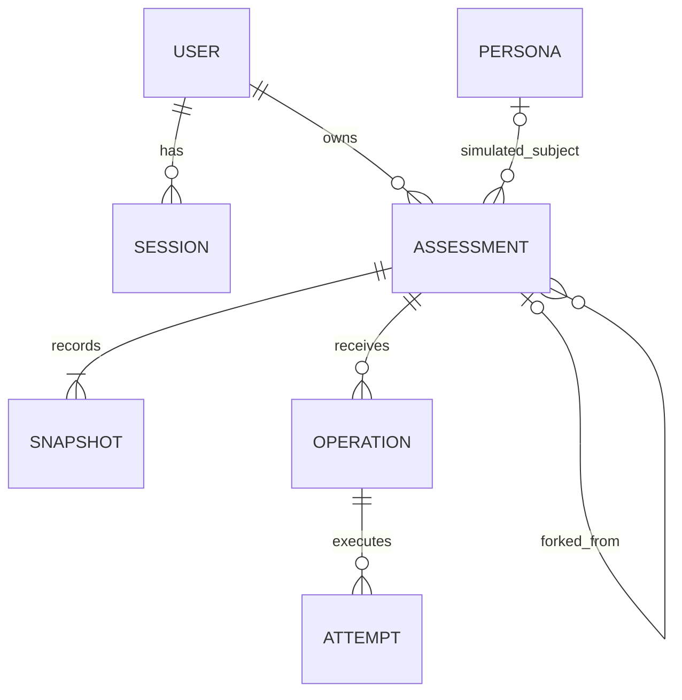

# Persistent assessments — approved design

Status: approved on 2026-09-23; implementation pending. [The implementation plan](persistence-implementation-plan.md) tracks delivery and validation. This document supersedes the browser-only persistence, no-account, destructive-restart, and generic-only sharing restrictions in the original MVP handoff. Those restrictions still describe the running implementation until the corresponding checkpoints land.

## Product behavior

Keep starting an assessment as fast as it is today. Neither registration nor an assessment-management screen belongs in the first-run path.

| Entry/action | Behavior |
| --- | --- |
| Main “Map your worldview” CTA; owner has zero assessments | Establish an anonymous session, create one private assessment, navigate directly to `/assessment/<id>` with the first prompt ready. |
| Same CTA; owner already has any assessments | Navigate to `/assessments`, whether there is one draft, multiple drafts, or only completed assessments. Do not choose a draft for the participant. |
| “My assessments” | Open the owner's library. An empty library may offer New assessment; the main CTA bypasses it. |
| Explicit New assessment | Create a new private assessment and navigate to it, preserving existing assessments. |
| View my results | Preview the current result; the assessment remains open. |
| Done | Finish the assessment without requiring publication. |
| Share | Explain once that the full submitted conversation and inferred results become public; finish and publish atomically. No account requirement. |
| Continue on an open assessment | Continue the existing interview. |
| Continue on a completed assessment | “Continue in a new assessment” creates a private fork, then continues or asks the selected clarification. |
| Make private | Remove public access; the completed content remains frozen. |
| Delete | Delete this assessment and its snapshots, operations, and attempt records. Independent forks remain. |

Creation uses an explicit mutation triggered by the CTA, not a side effect of rendering, prefetching, a crawler visit, or a GET. Establish the session before assessment creation; serialize the empty-library check and creation for that owner. Reuse a request key on uncertain retries. Loading and error states retain the CTA's one-click flow.

The public/private distinction is separate from operator access. Submitted answers, rejected replies, results, and bounded failure information are retained indefinitely unless the assessment is deleted. Operators may inspect private assessments to improve the product. Explain this before the first submission and in privacy documentation. Unsubmitted typing stays local, keyed by assessment; it is not uploaded for analysis.

The first interview permits 12 issued prompts. A fork permits up to 12 additional prompts, with an absolute maximum of 30 across the inherited conversation. Compute the fork ceiling as `min(inheritedPromptCount + 12, 30)`. Skipped and clarification prompts count as issued prompts; recovery attempts on the same prompt do not. Warn two prompts before the applicable ceiling. At a ceiling, finalize honestly even when evidence is insufficient; at 30, offer a fresh assessment rather than a fork that cannot continue. Readiness can still end the interview much earlier.

## Identity, routes, and access

Better Auth supplies anonymous users and persistent sessions in milestone one. X OAuth is the only interactive login provider in milestone two. A provider account and an assessment owner are separate concepts: an anonymous owner has no X account yet.

- Establish anonymous identity lazily when a participant starts, not for every landing-page visitor. Use Better Auth session cookies, with HttpOnly, appropriate SameSite, production Secure, origin protection, and a deliberately configured renewable lifetime. The initial target is 365 days with renewal on activity, subject to the pinned library/browser behavior verified in checkpoint 1. IDs and localStorage data do not confer ownership.
- `/assessments` lists the current owner's records. `/assessment/<id>` is the canonical owner view. Keep `/assessment` as an entry surface for old links, using the same explicit start behavior without GET creation. Avoid maintaining a second plural owner-detail route.
- `/assessments/public/<id>` reads the frozen published assessment, without a session. `/users/<slug>` selects a curated persona's current published simulation. Public reads never create anonymous users.
- Participant public pages are link-accessible, excluded from sitemaps/directories, and marked `noindex`. Curated persona pages remain indexable. `noindex` is a discoverability preference, not authorization.
- Private pages, private APIs, operation status, and owner exports authorize every request and use private/no-store responses. Knowing an assessment UUID is insufficient. Server code derives the owner from the session rather than trusting a body parameter.
- Public pages, metadata, and social images all check current publication state. Use request-time reads initially; do not statically export revocable participant content. Frozen content is server-rendered without inference.
- Clearing or expiring browser credentials loses access to anonymous private assessments, even though their records remain. An expired anonymous session is not an account-recovery mechanism.
- On X login, transfer all assessments belonging to the current anonymous identity to the authenticated identity, including when the X user already exists. Preserve IDs, visibility, timestamps, and fork provenance. Do not attach an X name or portrait to previously anonymous public assessments automatically.
- Make transfer transactional and retry-safe. Retain a recovery path until transfer succeeds; prevent deletion of anonymous users from cascading away assessments. Revoke old anonymous sessions after transfer. Logging out must not retain authenticated access; the next start can establish a new anonymous owner.

## Relational model

Use PostgreSQL and Drizzle with the normal PostgreSQL driver (`pg`). Local development uses native Postgres.app (already installed), with no Docker, Compose, or Testcontainers. The same application schema and migrations run against local Postgres and later Neon. Workflow SDK handles asynchronous execution; its official Postgres World uses the same local Postgres instance, preferably a separate workflow database to keep SDK-owned migrations isolated. Generate Better Auth's schema for the pinned release, then include it in the checked-in Drizzle migrations.

| Table | Required data |
| --- | --- |
| Better Auth `user`, `session`, `account`, `verification` | Library-managed identity and authentication, including the anonymous-user marker. Reserve a noninteractive service owner for generated simulations; it has no browser session or OAuth identity. |
| `assessments` | `id`, `owner_id`, nullable title, `origin` (`participant` or `simulation`), nullable `persona_id`, lifecycle (`open` or `completed`), visibility (`private` or `public`), current/final snapshot pointers, nullable source-assessment/source-snapshot pointers, persistent `is_fork` and inherited prompt count, prompt ceiling, pinned engine/content/rubric/model versions, create request key and fingerprint, timestamps. |
| `assessment_snapshots` | `id`, `assessment_id`, monotonically increasing revision, payload format/schema version, immutable JSONB payload, payload digest, evidence revision when available, producing operation, creation time. |
| `assessment_operations` | `id`, `assessment_id`, unique client request key, immutable action/input and fingerprint, base snapshot/revision, pinned execution versions, status, resulting snapshot, dispatch status/generation, canonical workflow run ID, attempt count, aggregate physical-request reservations, bounded last failure category, timestamps. |
| `assessment_operation_attempts` | Operation, dispatch generation, workflow run/step attempt identity, start/finish times, outcome, bounded diagnostic/stage progress and request-budget usage. Preserve previous failure attempts rather than overwriting the only evidence. |
| `personas` | Stable ID/unique slug, name, portrait, presentation metadata, current authored source brief, featured flag, selected assessment pointer, timestamps. |



Snapshots contain the typed question/answer history, rejected interaction history, evidence, judgments, recovery/routing state, and result together. A result is an interpretation of that snapshot's evidence, not an independently mutable row. SQL columns index ownership, lifecycle, provenance, versions, and ordering; JSONB holds the richer engine state. Keep browser drafts, session secrets, operational diagnostics, and transport bookkeeping outside the published snapshot payload. Failed uncommitted submissions remain in private operations rather than being presented as evaluated answers.

The lifecycle does not replace the engine's `answering`, `recovery`, `paused`, `results`, and `capped` states. An open assessment may already have results; completion is the boundary that freezes further content operations. `processing` is an operation state, not a reason to overwrite the last committed snapshot. The owner read combines the committed snapshot with any outstanding submitted action.

### Constraints and indexes

- Enforce unique `(assessment_id, revision)`, `(assessment_id, request_key)`, `(operation_id, dispatch_generation, step_attempt_key)`, and `(owner_id, create_request_key)`. Use a unique seed provenance key for imported/generated persona assessments.
- Compare fingerprints when replaying a key: the same key with a different input is a conflict, not an update. Snapshot writes are insert-only; duplicate insertion can return the existing identical row. An upsert must never overwrite frozen evidence, change input, resurrect a deleted assessment, or transfer ownership implicitly.
- Permit at most one active content operation per assessment, using a partial unique index over queued/running/retry-wait operations plus transactional validation. Index owner/library ordering and outstanding operation/dispatch status queries. Workflow owns its queue and execution indexes in its own tables.
- Current/final snapshot references must refer to snapshots of the same assessment. A completed assessment has a final snapshot; a public assessment is completed and has a participant-displayable result. Enforce these invariants with appropriate composite foreign keys/checks and transactions.
- A selected persona assessment belongs to that persona and is a completed public simulation. A simulation is distinct from a featured flag, and a persona is distinct from its service owner.
- Deleting an assessment cascades to its owned records. Source lineage references on surviving forks become null while `is_fork` and inherited-history markers remain, so deletion does not turn copied history into an apparently independent sample. Restrict deletion of a currently selected persona run until its pointer is cleared or replaced.
- Reject updates to snapshot payloads through the application repository. Verify this boundary in database integration tests; choose database enforcement or restricted application privileges where feasible without obstructing explicit deletion.

## Durable execution and idempotency

Use Vercel's open-source Workflow SDK, integrated with Next.js through `withWorkflow()`. The application operation is the durable record of submitted intent; Workflow owns execution, queueing, step retries, and replay. Do not build a second custom worker/lease queue alongside it.

### Local and hosted runtime choice

| Option | Decision |
| --- | --- |
| SDK Local World | Official zero-configuration development default. Persists run history in files but queues work in memory; pending queue entries do not survive restarts. Useful for an initial smoke check, but insufficient for this task's restart acceptance tests. |
| SDK Postgres World | Selected local runtime. Point it at native Postgres.app; bootstrap the package-managed tables and start the world through Next instrumentation. This supplies persistent queueing without Docker or a custom worker daemon. |
| Vercel World | Intended hosted execution backend when deployment is separately authorized. Use managed Vercel Workflow; do not deploy Postgres World's long-running poller inside serverless functions. Neon remains the application database. |
| Handwritten queue or another workflow service | Outside this plan unless the bounded SDK spike demonstrates an actual blocker. Record findings before replacing the selected backend. |

The Postgres World is an official alternative to the SDK's default local setup, selected because durability across restarts is an explicit requirement. Pin mutually compatible SDK/world versions, inspect their bundled docs and installed implementation, and verify their bootstrap/migration API. Upstream docs and package README differ on defaults and maturity labels; the integration gate is actual compatibility and fault testing, not a marketing label.

Retain the existing `pnpm dev` Portless command. Configure the Next wrapper and Node instrumentation to start the SDK's embedded worker once; no separate application worker process is needed. Validate internal workflow HTTP callbacks with Portless's actual hostname/port and SDK base-URL settings. Use the installed SDK CLI only for development diagnostics. Ordinary data inspection continues through normal Postgres tools; no operator dashboard or custom inspection CLI is added.

### Application operation lifecycle

```text
queued -> running -> succeeded
             |  |
             |  +-> retry_wait -> running
             +----> failed
queued/running/retry_wait -> cancelled
```

Keep dispatch status separately (`pending`, `started`, or a recoverable dispatch failure). A queued operation is durable even if Workflow has not yet accepted it. Application status must remain correct when a workflow fails abruptly or exhausts SDK retries; reconcile runtime state rather than relying only on a JavaScript catch block.

1. **Accept:** authenticate, validate action/size/version, briefly lock the assessment, verify expected revision and open lifecycle, and idempotently insert the operation and submitted text. Commit before dispatching. Return the existing operation on an identical retry, including its saved outcome if complete. The same key with changed input is a conflict.
2. **Dispatch:** call Workflow `start()` with only the operation ID and dispatch generation. Store its run ID. Database insertion and Workflow dispatch are not one atomic transaction, even if both happen to use the same Postgres server locally; explicitly handle a crash between them.
3. **Bind:** the workflow's first database step atomically binds the operation/generation to one canonical run. If `start()` succeeded but its response/run-ID write was lost, that first step can finish the binding. Duplicate workflow starts for the same generation become harmless no-ops before inference. Use a supported SDK idempotent-start mechanism if the pinned release provides one, but do not assume it exists or remove database safeguards.
4. **Process:** the first implementation uses one evaluation-and-commit step around the existing engine. It loads the immutable base snapshot and pinned bundle, records attempt/progress status, evaluates outside a database transaction, then commits. Pass IDs into and out of the step; load sensitive state inside it rather than duplicating transcripts into Workflow input/output logs. A replay after successful commit returns the recorded snapshot ID without reevaluating. Stage-level checkpointing can follow later; this spike does not restructure the whole inference pipeline.
5. **Commit:** in one transaction verify the canonical run/generation, expected base revision, assessment existence and open lifecycle. Insert the immutable snapshot, advance the assessment, and mark operation/attempt success. A duplicate result, cancelled run, superseded generation, or action against a deleted assessment cannot overwrite/recreate state.
6. **Recover:** a bounded reconciler finds operations whose dispatch did not complete, and compares nonterminal operations with their recorded Workflow runs. Redispatch missing work; let live/retrying workflows continue. If a run is terminally failed or truly missing, record the outcome and issue a new generation only under bounded retry rules. Never infer death merely from a long-running step's age. Generation checks prevent an old run from committing after replacement.
7. **Bound:** persist aggregate inference-request reservations before provider calls, including SDK retries. Keep reservations when actual cost is uncertain. The current code sets `limits.providerAttempts` to 32 in `lib/assessment/schema.ts`; preserve and test that aggregate bound across retries, updating older 24-request documentation. Use SDK retry/fatal-error conventions without multiplying unbounded application and SDK retry loops. Owner Retry is allowed only while the base revision is current, no competing operation is active, and budgets permit it.

Reconciliation runs at local application startup and periodically while the local server is running; share the same bounded function with a one-shot maintenance entry point. Hosted deployment must schedule it through an authenticated scheduler/cron or an equivalent durable mechanism. This is a small bridge for database-to-Workflow dispatch, not a second inference worker. The hosted trigger is a deployment prerequisite; merely installing Workflow does not repair a crash before `start()`.

Delivery is at least once, with at most one committed state transition per operation. A crash after provider success but before database commit can repeat inference; do not claim exactly-once provider execution or billing. Cancellation is best effort for external calls but definitive for subsequent database writes. Browser disconnects do not cancel accepted work.

Finish/share/fork serialize against active content operations. Their default response while processing is to wait/show the outstanding operation, not freeze a stale result. Deletion invalidates further commits and requests cancellation of related Workflow runs. Keep Workflow payloads to identifiers and safe status values, scrub errors, and account for SDK logs in retention/deletion documentation. A publish/private toggle uses explicit desired state, not a retry-sensitive inversion.

## Forks and historical results

Only the owner can fork a completed participant assessment, from its final snapshot. The copied initial snapshot is self-contained and starts a new private assessment. Preserve original answer text, evidence links, interpretations, pinned versions, and copied question identities; identifiers inside a snapshot are scoped so inherited IDs need not be globally rewritten. Reset request keys, operation revision bookkeeping, analytics event markers, and transient processing/animation state. Preserve semantic recovery/routing evidence; do not blindly shallow-copy execution state.

New questions and natural-language corrections append to the copied history. Opening a fork does not count inherited answers as new submissions or emit their old analytics events. Parent deletion and unpublishing do not change the independent fork. New submissions update only the fork. Direct editing of prior answers, earlier-point branching, public remixing, and evaluator upgrades are outside this scope.

## Personas and seeding

Repository-authored source briefs and generation configuration remain authoring inputs. Database persona rows and selected simulations supply runtime presentation. An idempotent seed synchronizes curated identity/source metadata; it does not overwrite immutable generated snapshots.

The existing canonical journey bundle has reduced projection inputs, not complete resumable Assessment states. Import only personas explicitly in the current public catalog, with their exact recorded transcripts, step results, projection inputs, source snapshots, timestamps/hashes, and sourced P(doom) overrides. Use an explicit historical payload discriminator such as `historical_journey_v1`; validate and render it through the existing persona adapter. Preserve missing fields as missing rather than manufacturing complete evidence or recovery history. Public fixture imports are completed and read-only, so resumability is unnecessary.

Future runs save full snapshots from the runner while the state exists. A successful validated regeneration inserts a new public simulation and atomically advances the persona's selected pointer. Failed runs retain bounded private operational records and leave the previous selection unchanged. Duplicate seeding or retrying publication of the same run must not create duplicate assessments or roll a selection back over a newer completed run. Record a generation ordering/provenance key to reject stale publication attempts.

Homepage, `/users/<slug>`, persona social images, and nearest-persona comparison values resolve the same selected run. Preserve simulated labeling and the distinction between current authored sources and the source snapshot used for that run. Direct public assessment URLs always retain their original frozen run. Importing existing data requires no paid inference.

## Public pages and social images

Publishing exposes the complete frozen assessment resource: submitted conversation history represented in that snapshot, questions, evidence, judgments, and results. It excludes auth/ownership secrets, local typing, and operational failure/provider transport records. Use an explicit public serializer so a future internal field does not automatically become public.

Generate a 1200 × 630 WebP social image with the installed Takumi renderer, extending `lib/sharing/social-card.tsx` and its existing WebP options. An explicit route such as `/assessments/public/<id>/social-image.webp` reads the final snapshot and current visibility; metadata uses its absolute URL and `image/webp`. A normal participant card uses its actual result and neutral assessment title, without a synthetic label or automatic X identity. Persona cards retain their simulated label and portrait. Keep existing participant PNG downloads available.

Initially serve public participant HTML, metadata, and image responses without shared caching. All three deny unpublished/deleted content, even when a snapshot ID is known. Render on demand without image hosting or a new service. External social networks may retain previews already fetched; making an assessment private cannot erase their copies. Verify generated bytes, dimensions, headers, contrast, long-title behavior, unknown placements, and metadata linkage; defer actual external crawler verification to a publicly reachable deployment.

## Primary implementation references

Consult the pinned package APIs before coding; these references informed the design on 2026-09-23.

- [PostgreSQL INSERT / ON CONFLICT](https://www.postgresql.org/docs/current/sql-insert.html) for idempotent insertion and [SELECT locking](https://www.postgresql.org/docs/current/sql-select.html#SQL-FOR-UPDATE-SHARE) for short application transactions. Immutable writes and optimistic concurrency remain application responsibilities.
- [Workflow Next.js setup](https://vercel.com/academy/workflow-foundations/set-up-the-pizza-tracker), [Local World limitations](https://workflow-sdk.dev/worlds/local), [Postgres World setup](https://workflow-sdk.dev/worlds/postgres), and [managed Vercel Workflows](https://vercel.com/docs/workflows). Workflow supplies execution; the database-to-runtime dispatch gap still needs application reconciliation.
- [Drizzle PostgreSQL](https://orm.drizzle.team/docs/get-started/postgresql-new) for the PostgreSQL driver and migration workflow. Pin compatible stable versions rather than copying an RC install command from a moving guide.
- [Better Auth anonymous users](https://better-auth.com/docs/plugins/anonymous), [Drizzle adapter](https://better-auth.com/docs/adapters/drizzle), and [X provider](https://better-auth.com/docs/authentication/twitter). Anonymous linkage requires application-owned assessment transfer and failure tests.
- [Neon connection URI API](https://api-docs.neon.tech/reference/getconnectionuri) describes pooled/direct connection selection. Use a direct migration connection as a project convention; verify chosen runtime/worker pooling behavior before hosting.
- [Takumi v2](https://takumi.kane.tw/docs/upgrade/v2) and the installed `takumi-js` types for WebP output. This repository already renders persona WebP cards.
