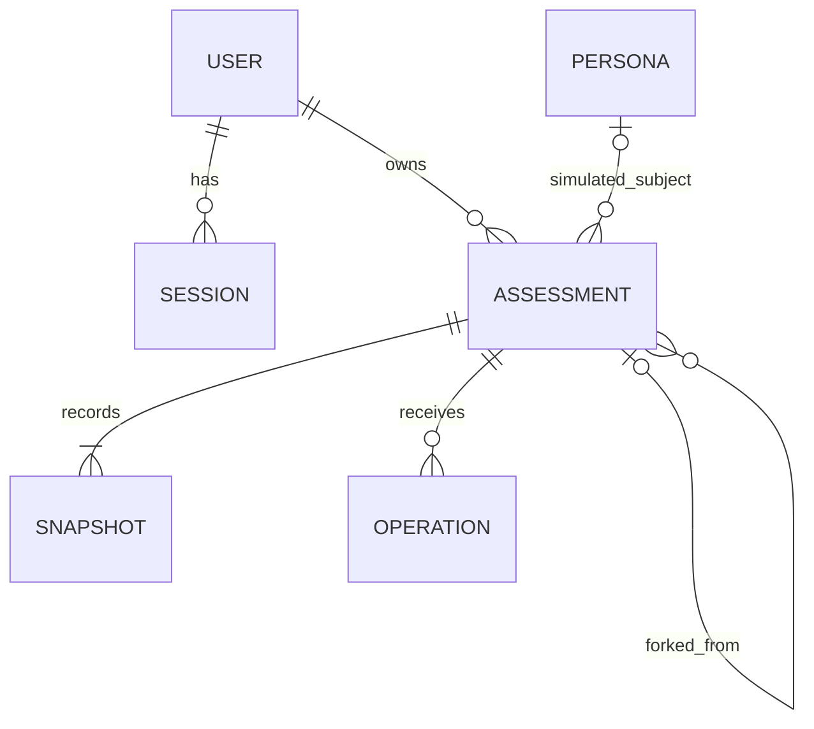

# Persistent assessments

This is the current persistence and ownership contract. Participant persistence, forks, publication, database personas and optional X ownership claims are implemented; [the implementation plan](persistence-implementation-plan.md) retains checkpoint evidence. Use [production readiness](production-readiness.md) for hosted setup and verification. Earlier browser-only, no-account and destructive-restart designs are historical.

## Product behavior

Keep starting an assessment as fast as it is today. Neither registration nor an assessment-management screen belongs in the first-run path.

| Entry/action | Behavior |
| --- | --- |
| Main “Map your worldview” CTA; owner has zero assessments | Follow a normal link to the assessment entry; on arrival establish an anonymous session, reserve a browser-backed draft and replace the URL with `/assessments/<id>` with the first prompt ready. |
| Same CTA; owner already has any assessments | Follow the link to `/assessments`, whether there is one draft, multiple drafts, or only assessments with results. Do not choose a draft for the participant. |
| “My assessments” | Open the owner's library. An empty library may offer New assessment; the main CTA bypasses it. |
| Explicit New assessment from the library | Reserve a new browser-backed draft URL and navigate to it, preserving existing assessments. |
| View my results | Generate results if needed; displaying an existing result is read-only. |
| Share | Explain once that the full submitted conversation and inferred results become public; publish the current result snapshot atomically. No account requirement. |
| Continue on a private assessment | Continue the existing interview. |
| Continue on a published assessment | “Fork & continue answering” creates a private fork, then continues answering. |
| Make private | Remove public access and allow additional answers on the same private assessment. |
| Delete | Delete this assessment and its snapshots, operations, and retained failure diagnostics. Independent forks remain. |

Starting uses an explicit POST triggered by the CTA, not a side effect of rendering, prefetching, a crawler visit, or a GET. Establish the session first, then issue a signed, owner-bound browser draft ticket and stable UUID without inserting an assessment, snapshot, operation, or reservation row. Reuse a request key on uncertain retries. Draft tickets are HttpOnly cookies scoped separately to the owner page and its API, with a one-year maximum lifetime; clearing browser credentials loses unsubmitted drafts. Back/Forward and reload preserve the URL and local typing. Explicit New assessment pushes a history entry; the first-run shortcut replaces its entry page. Unsaved drafts never appear in the library or change the returning-visitor CTA behavior.

The first submitted answer atomically creates the assessment, initial snapshot, and durable operation before inference. Failed processing remains recoverable using the ordinary operation retry flow. Forks already contain submitted history and are persisted immediately. A minimal `used_assessment_drafts` table retains only spent UUIDs, inserted at first submission, so deleting an assessment cannot allow an old signed ticket to recreate it. Tickets alone never authorize a different owner. Anonymous ownership claims transfer persisted assessments; unsubmitted browser drafts remain tied to their original identity. Loading and error states retain the CTA's one-click flow.

The public/private distinction is separate from operator access. Submitted answers, rejected replies, results, and bounded failure information are retained indefinitely unless the assessment is deleted. Operators may inspect private assessments to improve the product. Explain this before the first submission and in privacy documentation. Unsubmitted typing stays local, keyed by assessment; it is not uploaded for analysis.

The first interview permits 12 issued prompts. A fork permits up to 12 additional prompts, with an absolute maximum of 30 across the inherited conversation. Compute the fork ceiling as `min(inheritedPromptCount + 12, 30)`. Skipped and clarification prompts count as issued prompts; recovery attempts on the same prompt do not. Warn two prompts before the applicable ceiling. At a ceiling, finalize honestly even when evidence is insufficient; at 30, offer a fresh assessment rather than a fork that cannot continue. Readiness can still end the interview much earlier.

## Identity, routes, and access

Better Auth supplies anonymous users and persistent sessions. X OAuth is the only interactive login provider. A provider account and an assessment owner are separate concepts: an anonymous owner has no X account yet.

- Establish anonymous identity lazily when a participant starts, not for every landing-page visitor. Use Better Auth session cookies, with HttpOnly, appropriate SameSite, production Secure, origin protection, and a deliberately configured renewable lifetime. The initial target is 365 days with renewal on activity, subject to the pinned library/browser behavior verified in checkpoint 1. IDs and localStorage data do not confer ownership.
- `/assessments` lists the current owner's records. `/assessments/<id>` is the canonical owner view. Keep `/assessment` as an entry surface for old links, using the same explicit start behavior without GET creation. Old singular detail URLs redirect to the plural canonical URL.
- `/assessments` is the private/no-store route prefix. Public assessment routes live under `/public/assessments`; image caching applies only to successful public image responses, not as a blanket `/public` rule. The old `/assessments/public` routes have been removed without redirects before launch.
- `/public/assessments/<id>` reads the frozen published assessment, without a session. `/users/<slug>` selects a curated persona's current published simulation. Public reads never create anonymous users.
- Published participant pages are indexable at `/public/assessments/<id>` but are not enumerated in sitemap.xml or llms.txt. Discovery lists include only static public pages and curated personas; private and deleted assessments are excluded. Curated personas are listed at `/users/<slug>`; their immutable simulation URLs are not duplicated in discovery lists. Private owner routes and the legacy start page are noindex. robots.txt blocks owner/API routes and public JSON exports while allowing public pages and images; crawler rules are not authorization.
- Private pages, private APIs, operation status, and owner exports authorize every request and use private/no-store responses. Knowing an assessment UUID is insufficient. Server code derives the owner from the session rather than trusting a body parameter.
- Public HTML and metadata check publication state when generated, then use Next's revocable full-route cache with a 48-hour refresh. Publication changes and deletion explicitly expire that route immediately. JSON and social-image origin requests continue to check current visibility. Frozen content is server-rendered without inference; do not use an immutable static export for revocable participant content.
- Clearing or expiring browser credentials loses access to anonymous private assessments, even though their records remain. An expired anonymous session is not an account-recovery mechanism.
- On X login, transfer all assessments belonging to the current anonymous identity to the authenticated identity, including when the X user already exists. Preserve IDs, visibility, timestamps, and fork provenance. Do not attach an X name or portrait to previously anonymous public assessments automatically.
- Make transfer transactional and retry-safe. Retain a recovery path until transfer succeeds; prevent deletion of anonymous users from cascading away assessments. Revoke old anonymous sessions after transfer. Logging out must not retain authenticated access; the next start can establish a new anonymous owner.

## Relational model

Use PostgreSQL and Drizzle with the normal PostgreSQL driver (`pg`). Local development uses native Postgres.app, with no Docker, Compose, or Testcontainers. The same application schema and migrations run against local Postgres and hosted Neon. Assessment operations execute synchronously inside the main POST handlers; no asynchronous runtime or additional database is required. Generate Better Auth's schema for the pinned release, then include it in the checked-in Drizzle migrations. Production Neon and OAuth credentials are kept in ignored `.env.production.local`, using the same names as development (`DATABASE_URL`, `DATABASE_MIGRATION_URL`, `X_CLIENT_ID`, `X_CLIENT_SECRET`). Development values stay in `.env.development.local`. Next.js selects files by environment; `pnpm build:local` and `pnpm start:local` explicitly preload development settings for local production-mode acceptance. Hosted production supplies its own environment values. Production migrations and deployment remain explicitly separate tasks.

| Table | Required data |
| --- | --- |
| Better Auth `user`, `session`, `account`, `verification` | Library-managed identity and authentication, including the anonymous-user marker. Reserve a noninteractive service owner for generated simulations; it has no browser session or OAuth identity. |
| `assessments` | `id`, `owner_id`, nullable title, `origin` (`participant` or `simulation`), nullable `persona_id`, visibility (`private` or `public`), current/published snapshot pointers, nullable source-assessment/source-snapshot pointers, persistent `is_fork` and inherited prompt count, prompt ceiling, pinned engine/content/rubric/model versions, create request key and fingerprint, timestamps. |
| `assessment_snapshots` | `id`, `assessment_id`, monotonically increasing revision, payload format/schema version, immutable JSONB payload, payload digest, evidence revision when available, producing operation, creation time. |
| `assessment_operations` | `id`, `assessment_id`, unique client request key, immutable action/input and fingerprint, base snapshot/revision, pinned execution versions, status (`running`, `succeeded`, `failed`, or `interrupted`), resulting snapshot, nullable retry-of operation ID, request deadline, physical-request count, bounded call-failure/diagnostic history, failure category, timestamps. |
| `personas` | Stable ID/unique slug, name, portrait, presentation metadata, current authored source brief, featured flag, selected assessment pointer, timestamps. |



Snapshots contain the typed question/answer history, rejected interaction history, evidence, judgments, recovery/routing state, and result together. A result is an interpretation of that snapshot's evidence, not an independently mutable row. SQL columns index ownership, visibility, provenance, versions, and ordering; JSONB holds the richer engine state. Keep browser drafts, session secrets, operational diagnostics, and transport bookkeeping outside the published snapshot payload. Failed uncommitted submissions remain in private operations rather than being presented as evaluated answers.

Each newly saved participant assessment or fork gets a library-only name, `Your AI worldview #N`, using the owner’s current assessment count plus one. Existing unnamed rows use their creation-order position in the library. Deletion, concurrent creation, and account merges do not require special numbering rules.

The library uses a shadcn data table with separate sortable creation-date and status columns, defaulting to newest created first. Assessment titles open the private detail page; Published badges open the public page. Management actions live in each row’s dropdown, with confirmation before deletion. For private rows with results, the first menu action is Publish assessment, using the same confirmation dialog as the detail page. Published rows also offer View public assessment and Copy link to public assessment in the menu. Rows with results offer Download results image, Copy results image, and Download full report. Image exports require ownership and use the shared PNG renderer with no-store responses; full reports use the shared map and ZIP template, including available local diagnostics. There is no pagination, filtering, selection, or column chooser.

The library derives three statuses: **In progress** (private without results), **Ready to publish** (private with results for the current evidence), and **Published** (public). There is no open/completed lifecycle or completion operation. The engine separately records `answering`, `recovery`, `results`, or `capped`; exhausted recovery is contextual feedback, not a paused assessment. Request processing is a separate operation state. Reading any page never mutates the snapshot.

Ordinary answer processing interprets evidence and routes follow-ups, without constructing a full result. Routing includes lightweight outlook/basis judgments for readiness. Generate results only on explicit request, an automatic routing stop, or the question cap. Debug mode only captures diagnostics. A new accepted answer invalidates prior results until regenerated. Offline persona generation explicitly requests eligible per-answer result snapshots for its authoring output.

### Constraints and indexes

- Enforce unique `(assessment_id, revision)`, `(assessment_id, request_key)`, and `(owner_id, create_request_key)`. Use a unique seed provenance key for imported/generated persona assessments.
- Compare fingerprints when replaying a key: the same key with a different input is a conflict, not an update. Snapshot writes are insert-only; duplicate insertion can return the existing identical row. An upsert must never overwrite frozen evidence, change input, resurrect a deleted assessment, or transfer ownership implicitly.
- Permit at most one active content operation per assessment, using a partial unique index over `running` operations plus transactional validation. Index owner/library ordering and operation lookup. The request deadline bounds how long an interrupted process can block subsequent mutations; this is concurrency control, not a job queue.
- Current/published snapshot references must refer to snapshots of the same assessment. A public assessment has a published snapshot equal to its current snapshot and a participant-displayable result; private assessments have no published pointer. Enforce these invariants with appropriate composite foreign keys/checks and transactions.
- A selected persona assessment belongs to that persona and is a public simulation. A simulation is distinct from a featured flag, and a persona is distinct from its service owner.
- Deleting an assessment cascades to its owned records. Source lineage references on surviving forks become null while `is_fork` and inherited-history markers remain, so deletion does not turn copied history into an apparently independent sample. Restrict deletion of a currently selected persona run until its pointer is cleared or replaced.
- Reject updates to snapshot payloads through the application repository. Verify this boundary in database integration tests; choose database enforcement or restricted application privileges where feasible without obstructing explicit deletion.

## Synchronous execution and idempotency

Treat each answer, next-question, or result operation as one bounded unit executed by the main POST request. The request waits for the evaluator and returns success or failure. No Workflow SDK, async job system, worker, queue, outbox, dispatcher, scheduler, or automatic post-restart execution is included.

Atomicity applies to assessment state: all new answers/evidence, routing state, and results become visible together, or the previous snapshot remains unchanged. The submitted input and operation/failure record are deliberately retained separately for recovery and inspection. External Jev calls cannot be rolled back, and a database transaction should not stay open while waiting on them.

```text
POST -> save submitted operation -> evaluate (retry a transient call once)
                                      |                     |
                                      v                     v
                               commit new snapshot     record failure
                               and return success      keep prior snapshot
```

1. **Accept:** authenticate and validate action/size/version. In a short transaction, lock the assessment, verify the expected revision and private visibility, handle any expired operation, then idempotently insert the immutable input and `running` status with a fixed request deadline. Commit before evaluation. A matching request key returns the saved outcome if terminal, or an explicit in-progress response if the original request is still running. It never starts a second evaluation. Changed input under the same key is a conflict.
2. **Evaluate:** load the pinned base snapshot/bundle and execute the existing engine inside the same HTTP handler, outside a database transaction. Keep intermediate state in memory. Record bounded diagnostics for a failed Jev call and retry that call at most once when the failure is transient and the deadline/budget permits it. A second failure fails the entire operation. Permanent validation/configuration errors fail immediately. There is no automatic whole-operation retry or persisted stage-resume mechanism.
3. **Commit:** in one short transaction check that this exact operation is still running, its deadline has not passed, the assessment exists and remains private, and its head revision still matches the base. Insert the immutable snapshot, advance the head, and mark the operation succeeded atomically. Return the committed snapshot. A stale or timed-out handler cannot commit after another request has marked it interrupted or after deletion/publication.
4. **Fail:** conditionally mark a still-running operation failed with a bounded, safe error record and return an error while leaving the last committed assessment state unchanged. Preserve the submitted text. A final database commit failure also leaves the old snapshot intact; if the database is unavailable, the preexisting running row and deadline identify the interrupted attempt when access returns. If commit success is uncertain because its acknowledgment was lost, reread the operation before reporting a definitive failure or retrying inference; never downgrade a succeeded operation.
5. **Retry explicitly:** after a failed/interrupted operation, the participant's Retry sends the saved action with a new request key and `retry_of` reference. Verify the source operation belongs to the assessment and the same owner, and that its base revision is still current. Keep the previous attempt's failure record. Uncertain network retries of the original POST reuse the original key to discover whether it committed; they are distinct from an explicit retry after a known failure.

A server crash does not cause automatic resumption. Owner reads show the committed snapshot and retained submission; a running operation beyond its deadline is displayed as interrupted. On the next authorized mutation, a short transaction marks the expired operation interrupted before accepting any replacement. A read may derive that status from the deadline without performing a mutation. No sweeper or background process is needed. At most one active content operation is accepted at a time; competing tabs receive an explicit busy/conflict response.

The owner view derives `provider_rejected` from an `evaluation_failed` operation whose last recorded provider call returned HTTP 403. Its persistent alert names TypeSafe (Jev), confirms the submission is saved, and asks the participant to try later. This covers historical records without rewriting them or exposing diagnostic payloads. Other failures retain neutral recovery copy. The alert survives reload and offers the existing explicit retry; it does not claim a provider outage or explain why access was denied.

A disconnected browser may miss a success response or the handler may be cancelled; do not depend on it continuing after disconnect. On reload, fetch the saved operation/state to distinguish committed, still-running, failed, and interrupted outcomes. Only poll status when resolving an existing in-flight/uncertain request, not as the primary submission protocol. Preserve a local draft until server acceptance is known.

Use the current bounded operation deadline (120 seconds in the baseline) and an abort signal for all provider calls. Ensure the eventual hosting request-duration setting accommodates it; deployment remains separate. The current aggregate physical-request cap is 32 (`limits.providerAttempts` in `lib/assessment/schema.ts`). One logical operation can contain multiple batches; preserve the aggregate cap while enforcing at most one retry per failed call. Audit SDK/transport and engine retry layers so they do not multiply retries or let oversized-batch fallback silently exceed the newly approved retry policy. Maximum-history fixtures must validate any required batching changes; never drop evidence to fit a retry.

A failed call or interrupted operation may already have incurred provider cost. An explicit retry can repeat earlier successful calls because the whole uncommitted operation runs again. This is an accepted simplicity tradeoff, not exactly-once inference or billing.

Finish/share/fork serialize against a live operation and do not freeze a stale result while it is processing. Deletion removes its records; the final commit requires their continued existence and cannot recreate them. A publish/private change specifies the desired value rather than applying a retry-sensitive toggle. Ordinary Postgres tooling suffices for inspection.

## Forks and historical results

Only the owner can fork a published participant assessment, from its published snapshot. The copied initial snapshot is self-contained and starts a new private assessment. Preserve original answer text, evidence links, interpretations, pinned versions, and copied question identities; identifiers inside a snapshot are scoped so inherited IDs need not be globally rewritten. Reset request keys, operation revision bookkeeping, analytics event markers, and transient processing/animation state. Preserve semantic recovery/routing evidence; do not blindly shallow-copy execution state.

New questions and natural-language corrections append to the copied history. Opening a fork does not count inherited answers as new submissions or emit their old analytics events. Parent deletion and unpublishing do not change the independent fork. New submissions update only the fork. Direct editing of prior answers, earlier-point branching, public remixing, and evaluator upgrades are outside this scope.

## Personas and seeding

Repository-authored source briefs and generation configuration remain authoring inputs. Database persona rows and selected simulations supply runtime presentation. An idempotent seed synchronizes curated identity/source metadata; it does not overwrite immutable generated snapshots.

The existing canonical journey bundle has reduced projection inputs, not complete resumable Assessment states. Import only personas explicitly in the current public catalog, with their exact recorded transcripts, step results, projection inputs, source snapshots, timestamps/hashes, and sourced P(doom) overrides. Use an explicit historical payload discriminator such as `historical_journey_v1`; validate and render it through the existing persona adapter. Preserve missing fields as missing rather than manufacturing complete evidence or recovery history. Public fixture imports are published and read-only, so resumability is unnecessary.

Live runs save full `simulation_v1` snapshots from the runner while the state exists. Before inference, a private `generation_input_v1` snapshot and running operation capture the input and provenance. These are synchronous offline runs, with a 30-minute publication deadline and no automatic retry; participant POST deadlines remain unchanged. A successful validated regeneration inserts a new public simulation and atomically advances the persona's selected pointer. Failed runs retain bounded private operational records and leave the previous selection unchanged. Duplicate seeding or retrying publication of the same run must not create duplicate assessments or roll a selection back over a newer published run. Record a generation ordering/provenance key to reject stale publication attempts.

Homepage, `/users/<slug>`, persona social images, and nearest-persona comparison values resolve the same selected run. Preserve simulated labeling and the distinction between current authored sources and the source snapshot used for that run. Direct public assessment URLs always retain their original frozen run. Importing existing data requires no paid inference.

## Public pages and social images

The landing map, `/users` directory, and every selected public `/users/<slug>` profile are generated during the production build, including unfeatured users. They use a 48-hour ISR interval (`revalidate = 172800`). Full HTML and React payloads are cached; after expiry, the next visit receives the existing page while regeneration refreshes it in the background. A failed regeneration preserves the last successful page. Metadata and page rendering share a request-deduplicated single-profile query during generation. Selection/source changes become visible after successful revalidation or a new deployment; CLI/database changes do not trigger immediate invalidation. sitemap.xml and llms.txt use the same interval.

Profiles use `dynamic = 'force-static'` and `dynamicParams = true`. Every selected profile present at build time is pregenerated; new slugs introduced after that build can render on demand, so a revalidated directory never links to a route rejected solely because it was absent at build time. That exceptional first request can read Postgres and block on generation. Seed/select new profiles before building/deploying to give them the same pregenerated first-visit experience. The map and discovery routes reject request-time server APIs with `dynamic = 'error'`; account/session controls resolve separately on the client. About retains its 24-hour ISR interval. Private assessment routes remain request-time, authenticated, and no-store.

Map and directory links disable automatic viewport prefetching. A shared intent controller enables up to three distinct nearby portrait links (within 72 CSS pixels of their rendered edges), ranked by proximity with direct hover first. Nearby intent waits 100ms, hover waits 60ms, and successive pointer-driven batches are rate limited to 300ms. Keyboard focus and pointer-down take immediate priority. Leaving proximity, scrolling, hiding the page, or leaving the map removes obsolete queued work; focused links survive focus-induced scrolling. Save-Data, 2G connections, and offline state suppress speculative requests. Only candidate links rerender, and Next's router cache deduplicates and reuses completed prefetches. Three is the number of eligible profile routes, not a strict transport concurrency guarantee: Next's public Link API cancels queued/blocked tasks but does not abort already-started HTTP requests. Those requests can finish into its cache. Do not replace router prefetching with raw HTML fetches that would fail to populate the router cache.

Publishing exposes the complete frozen assessment resource: submitted conversation history represented in that snapshot, questions, evidence, judgments, and results. It excludes auth/ownership secrets, local typing, and operational failure/provider transport records. Use an explicit public serializer so a future internal field does not automatically become public.

Generate 1200 × 630 social images with the installed Takumi renderer. Public assessment previews at `/public/assessments/<id>/social-image.webp` read the final snapshot and current visibility; metadata uses their absolute URL and `image/webp`. Profile previews at `/users/<slug>/opengraph-image?v=png-1` use PNG with matching `image/png` metadata; the image URL version separates them from earlier cached WebP previews. A normal participant card uses its actual result and neutral assessment title, without a synthetic label or automatic X identity. Persona cards retain their simulated label and portrait. Keep existing participant PNG downloads available.

Every currently published participant assessment is pregenerated during the production build. `/public/assessments/<id>` caches complete HTML and React payloads with `revalidate = 172800`, including indexable canonical metadata, Open Graph/Twitter previews, full answer text, and result disclosures. Client hydration enables interactions. Newly published assessments and historical simulation URLs can generate on demand. Successful publication expires earlier page/404 caches and schedules an unauthenticated page warmup after the response, using only the deployment's configured origin. Warmup failure is logged and leaves on-demand generation available; it never rolls back publication. No inference runs during generation.

After an authorized visibility change or deletion commits, the API calls `revalidatePath` for that assessment's public page. Explicit invalidation expires HTML/RSC immediately rather than serving stale content for another 48 hours; ordinary time-based refresh still uses stale-while-revalidate. The JSON resource remains private/no-store and checks current visibility on every request. Keep all visibility/deletion mutations connected to invalidation; direct database edits bypass it. Published participant IDs are not added to sitemap.xml or llms.txt. Already downloaded content and browser router copies cannot be recalled.

Successful public Takumi image GET responses (participant and persona previews) are fresh in browsers and shared caches for seven days, with one additional day of stale-while-revalidate reuse while refreshing in the background; the accepted tradeoff is that cached images can remain accessible for up to eight days after unpublishing or deletion. Origin requests still deny unpublished/deleted content. Private PNG export POST responses and errors remain no-store. Render on demand without image hosting or a new service. External social networks may retain previews already fetched; making an assessment private cannot erase their copies. Verify generated bytes, dimensions, headers, contrast, long-title behavior, unknown placements, and metadata linkage; defer actual external crawler verification to a publicly reachable deployment.

## Primary implementation references

Consult the pinned package APIs before coding; these references informed the design on 2026-09-23.

- [PostgreSQL INSERT / ON CONFLICT](https://www.postgresql.org/docs/current/sql-insert.html) for idempotent insertion and [SELECT locking](https://www.postgresql.org/docs/current/sql-select.html#SQL-FOR-UPDATE-SHARE) for short application transactions. Immutable writes and optimistic concurrency remain application responsibilities.
- [Drizzle PostgreSQL](https://orm.drizzle.team/docs/get-started/postgresql-new) for the PostgreSQL driver and migration workflow. Pin compatible stable versions rather than copying an RC install command from a moving guide.
- [Better Auth anonymous users](https://better-auth.com/docs/plugins/anonymous), [Drizzle adapter](https://better-auth.com/docs/adapters/drizzle), and [X provider](https://better-auth.com/docs/authentication/twitter). Anonymous linkage requires application-owned assessment transfer and failure tests.
- [Neon connection URI API](https://api-docs.neon.tech/reference/getconnectionuri) describes pooled/direct connection selection. Use a direct migration connection as a project convention; verify request-handler pooling behavior before hosting.
- [Takumi v2](https://takumi.kane.tw/docs/upgrade/v2) and the installed `takumi-js` types for PNG and WebP output; see the route-specific formats above.

### Implemented X claim boundary

The pinned anonymous plugin’s `onLinkAccount` runs after Better Auth prepares the new authenticated session. The application locks both owners, transfers participant assessment ownership (namespacing creation keys to avoid cross-owner collisions), revokes old sessions and deletes the anonymous owner in one transaction. Snapshot contents, IDs, publication and in-flight operation authorization remain unchanged. Restrictive owner FKs roll back the entire transfer if any owned data would be left behind.

On transfer failure the hook strips the prepared Set-Cookie headers and redirects to the library with a recoverable error, preserving the browser’s anonymous session. Tests execute the actual pinned callback to verify this timing. Retrying login to an existing provider identity merges assessments into that account. X email-based linking is disabled; only provider/account identity is used. Local X login, anonymous claim, sign-out and subsequent recovery were verified on 2026-09-23. Production callback verification remains part of a separate deployment task.

Sharing is offered from the results view. The API requires a current meaningful result, independently of the interview display mode. There is no Done button. Historical background projections are excluded from result readiness during migration; immutable snapshot payloads remain unchanged.

Private assessment, public assessment (including simulations), and persona detail routes use the shared `AssessmentPage` layout wrapper. All routes use the global h1–h6 type scale; result sections choose heading levels without local font-size overrides. Persona sources and assessment resources both render through `ResourceList` and `ResourceBookmark`; keep bookmark typography inside that component.

Public participant pages reuse the private conversation components, including collapsed long answers and answer navigation. Omit question turns with no submitted reply from the public page, including a pending question left behind when the participant requests results; preserve submitted recovery replies and leave the frozen resource unchanged. They show the centered worldview CTA card, without an extra Results heading, owner review/report controls, or raw-data disclosures/download links. The authorized public data endpoint remains available.

Participant error messages come from controlled error codes or action-specific fallback copy. Never display raw API, database, provider, or browser exception messages. Detailed diagnostics belong in server logs and explicitly enabled debug tools; network failures retain the original pending submission for recovery.

Publishing while signed in captures a public profile snapshot (display name, high-resolution portrait, and X profile link) alongside the published assessment pointer. It is shown through the same ProfileHeader as personas. Anonymous publications have no attribution and use “Your AI worldview.” Login/ownership transfer, profile edits, and repeated publish requests do not change existing attribution. Unpublishing clears it; explicit republication captures the current publisher profile. Existing publications are not backfilled because their authentication state at publication was not recorded.

Private and public participant pages load persona comparison inputs through the same cached server loader and use the same ranking/rendering components. Public rendering must not substitute an empty persona list; a genuine catalog loading failure retains the shared unavailable state and emits redacted server diagnostics.

### Published profile handles

X OAuth stores the provider-returned username in a non-client-editable user field and refreshes it on sign-in. Explicit publication copies this latest known handle into the publication snapshot alongside name, portrait, and the stable X user-ID URL. Display `x.com/username`; subsequent profile changes do not rewrite published attribution. Older publications without a captured handle use “Profile” until their owner signs in again and explicitly republishes. Do not infer historical handles from display names or attach identities to anonymous publications.

Public assessment WebP previews use the same `resultCardData` and `renderShareCard` path as downloaded social-sharing PNGs. Both show the map, P(doom), closest-persona portraits, and result date; only encoding and pixel density differ for participant images. Public image origin requests check current publication before rendering; successful previews carry seven-day public freshness plus a one-day stale-while-revalidate allowance. Cached copies may outlive revocation by up to eight days. Owner-only PNG exports remain private/no-store.

Browser map portraits use `getImageProps` from `next/image` for resized URLs while retaining native SVG clipping. The SVG records the original portrait source separately; PNG export embeds those original bytes before sending the SVG to Takumi, preserving export resolution. Social cards continue to load original portraits through their own renderer. The site-header account avatar uses Next's `Image` with an initials fallback on failure; local paths and the existing `https://pbs.twimg.com/profile_images/**` allowlist cover these image sources.

### Vercel Preview isolation

Vercel Preview deployments use the separate Neon project `doom-or-bloom-preview` (`jolly-frog-41412992`), branch `main`, database `doom_bloom_preview`. This is a fresh database migrated from `drizzle/` and seeded with the repository's curated persona simulations; production accounts and participant answers are not copied. Preview deployments share this preview database with each other, not with production. Use the pooled `DATABASE_URL` for the app and the direct `DATABASE_MIGRATION_URL` for explicit preview migrations. Preview has its own `BETTER_AUTH_SECRET`.

Preview authentication derives its exact allowed HTTPS origins from Vercel's `VERCEL_URL` and optional `VERCEL_BRANCH_URL`; do not set Preview `BETTER_AUTH_URL` to the production domain. Production and local development continue to use their explicit `BETTER_AUTH_URL`. Request-provided origins or forwarded hosts cannot add hosts to the preview allowlist.

X OAuth is intentionally not configured for Preview. Production and local development retain their own X credentials and callback URLs. Anonymous creation, persistence, and sharing remain available in previews. Schema changes must be migrated against the preview database before redeploying; deployment builds do not run migrations automatically.

### Simulated-user directory (September 25, 2026)

Authored presentation fixtures supply `featured` explicitly. Both profile imports and live generation persist that value; they must never unconditionally promote all profiles to featured. Historical metadata without the field defaults to true for compatibility with the original curated collection. `/users` reads all selected public simulations, while `/` and participant comparisons read only featured simulations. New unfeatured simulations retain the same detail, export, and source provenance behavior. `/users` and `/` use the same build-time generation and 48-hour revalidation policy as simulated profiles, as described above.

## Local generated simulation files

Generated interviews and assessment snapshots are untracked local data under `work/journeys/`, stored per user with atomic run manifests. Authored source briefs remain versioned. PostgreSQL remains the public profile store. See [local journey storage and regeneration](user-journeys.md) for importing existing results and generating fresh ones.

## Persona query payloads and lookup indexes

List views and participant comparisons select persona metadata, current and recorded source lists, and the selected run's result directly in SQL. They never fetch the full interview, intermediate projections, or duplicated assessment state. Featured-only reads filter `personas.featured` in SQL. Single-profile pages continue to read their complete selected snapshot; full catalog reads are reserved for offline import and verification. Results, ordering, and the current-versus-recorded source distinction remain identical for historical and live simulation formats. This query projection does not alter immutable snapshots or introduce a separate cache to invalidate.

The owner-library index matches `(owner_id, created_at)`. Account identity lookup uses `(provider_id, account_id)` without adding a new uniqueness constraint. Source-assessment, source-snapshot, and operation-retry indexes support foreign-key cleanup on deletion. Keep the account lookup index when regenerating Better Auth's schema. Migration `0006_sloppy_maginty` adds these indexes and replaces the old library ordering index; it requires an explicit migration in each hosted environment before release. It uses ordinary transactional index creation, so schedule its application with consideration for write locks on larger hosted tables.

## Local operator inspection

The development-only `/admin` dashboard uses a separate read-only connection and guarded Next routes. It supports local or production inspection without changing the ordinary app database. See [admin tooling](admin.md) for launch commands, metric definitions, isolation, and Drizzle Studio. Opening drafts is not persisted, so database-derived starts are first submissions or created forks.
