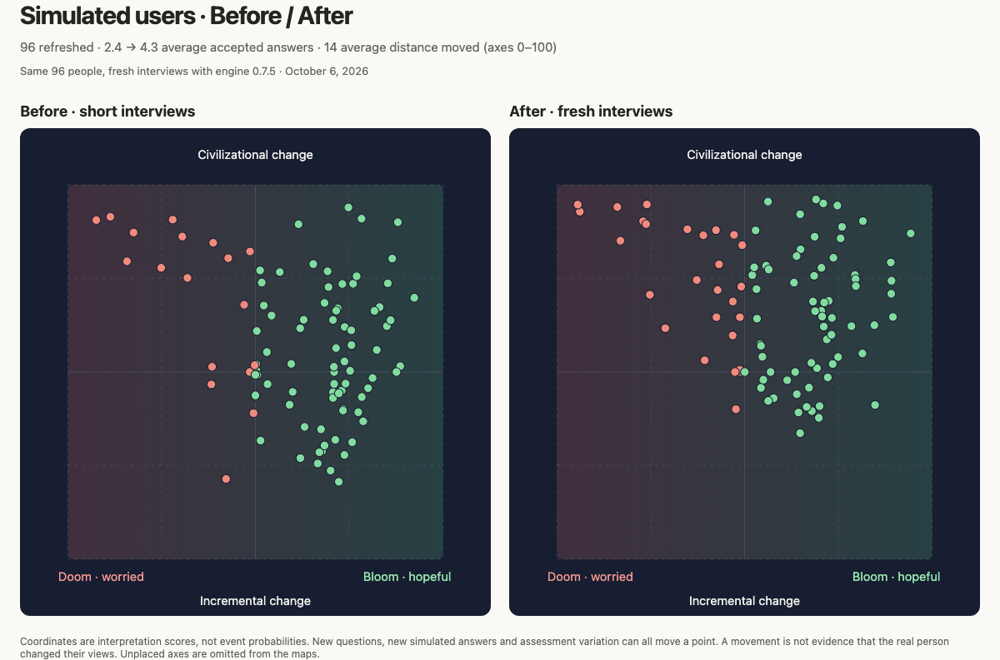

# Short simulated-user interview refresh — October 6, 2026

At Travis's request, regenerated and published all 96 production simulated users whose selected interviews contained fewer than four answered questions. This includes all eight profiles still using engine `0.6.1`: Alex Zhang, Stella Biderman, Fabian Stelzer, Julia Galef, Kylie Robison, Liminal Bardo, Sauers and Theia Vogel. Of the other 88, the selected scores used `0.7.5` but came from replays of short transcripts.

## Generation and scope

- Fresh GPT-5.6 Sol answers through the normal live Jev interview engine `0.7.5`, content `0.4.0-draft`, rubric `0.1.0-draft`, model `jev-1.13.0`.
- Used the current source briefs for the selected people. No external source research, question edits, manual map coordinates or re-scoring of old answers.
- 24 bounded four-person batches, four concurrent interviews per batch, at most 12 answer opportunities, 1536 physical Jev requests and an $8 estimated-cost cap per batch. Automatic stopping remained enabled.
- All 96 runs succeeded: 72 with four accepted answers, 22 with five, two with six. There were 410 participant calls and 2470 physical Jev requests. Estimated total cost: $7.37; this estimate is not a provider invoice.
- Generation ran from commit `868a5e99`. The newer production release `7e3e39d9` changed Sam Altman's brief and presentation; its engine, questions and all 96 selected briefs match the generation checkout.
- Sam Altman was excluded because his selected production interview already had five accepted answers. djcows was excluded because its interview contained five replies, although only three were accepted.

## Production verification

The ordinary import command was planned read-only, then written for the explicit 96-slug cohort, in four disjoint import processes. All selected production payload digests match their generated local counterparts. Every selected run is new, has a result, uses `0.7.5` and contains at least four accepted answers. All 96 preceding public assessment URLs retain their original payload digests and public visibility. The other 117 profiles' selected assessments are unchanged.

After the import, the production catalog contained 213 selected results, all using `0.7.5`, with no interview shorter than four answered questions. The single three-accepted-answer profile is djcows, described above.

Purged the project's CDN and Data caches and rebuilt production from the existing release `7e3e39d9979caf2f4e9df28740b6abee601d14bd`: deployment `dpl_E4AmnosVNUmg8Xa2ywDySL2xUaJU`. Verified all 96 live English profile pages return 200 and include the new answer counts; all 96 public comparison endpoints return the map coordinates recorded in the new selected production results. Verification time: 2026-10-06T01:53:18.204Z.

## Before and after

The comparison uses the selected public production snapshots immediately before and after import, with the same coordinate rules as `resultPoint`: expressed outlook horizontally and current-evidence transformation vertically. Coordinates below use a 0–100 scale.

Average accepted answers increased from 2.39 to 4.27. Average Euclidean distance moved was 14.1 coordinate points (median 13.6). Average outlook moved -3.5 points; transformation moved +10.5 points. 62 profiles moved more than 10 points on at least one axis.

The largest distances were Victor Taelin, Andrew Curran, Joscha Bach, Mario Zechner and Sauers. Sampled their relevant answers against their saved briefs, plus Fabian Stelzer's six-answer interview. Changes include clarified outlook, explicit expectations about transformation and more honestly retained uncertainty. This is an editorial spot check, not blinded semantic validation. Regenerated questions, fictional answers and judgment variation all contribute; map movement does not establish a change in the real person's views.

Created a standalone side-by-side HTML visual with synchronized hover/focus labels, search and a movement table, plus PNG exports. Browser checks verified 96 points per map, all 96 rows, correspondence, search, mobile fit and absence of script errors. Local artifacts and scripts are retained under `work/refresh-2026-10-06/`; the interactive visual and compact comparison JSON are attached to the Codex chat. The review assets below contain public result metadata only.

[Download the 96-profile result manifest](short-interview-refresh-2026-10-06/results.csv).

| Simulated user | Old engine | Accepted answers | Before (outlook, transformation) | After (outlook, transformation) |
| --- | --- | --- | --- | --- |
| Kyle Mistele (`0xblacklight`) | 0.7.5 | 3 → 4 | 50.2, 52 | 48.7, 64.6 |
| Mira (`_mira___mira_`) | 0.7.5 | 3 → 4 | 73, 45 | 61.4, 47.8 |
| xjdr (`_xjdr`) | 0.7.5 | 3 → 4 | 73.7, 27.8 | 67.2, 45.8 |
| Alex Zhang (`a1zhang`) | 0.6.1 | 3 → 4 | 53.3, 46.7 | 56.9, 50 |
| Aaron Francis (`aarondfrancis`) | 0.7.5 | 2 → 4 | 79, 36.7 | 84.8, 41.2 |
| Adam Elmore (`adamdotdev`) | 0.7.5 | 2 → 4 | 51.4, 31.7 | 47.7, 40.1 |
| Alex Volkov (`altryne`) | 0.7.5 | 1 → 4 | 67.8, 28.8 | 67.9, 39.6 |
| Andrew McAfee (`amcafee`) | 0.7.5 | 1 → 4 | 88.6, 51.6 | 89.1, 70.9 |
| Andrew Curran (`andrewcurran_`) | 0.7.5 | 2 → 4 | 38.8, 84.5 | 71, 95 |
| Andrew Ng (`andrewyng`) | 0.7.5 | 2 → 4 | 87.6, 50 | 89.6, 64.7 |
| Andy Ayrey (`andyayrey`) | 0.7.5 | 2 → 4 | 71.9, 67 | 68.7, 86.1 |
| watermark (anthrupad) (`anthrupad`) | 0.7.5 | 3 → 4 | 30.5, 86.2 | 52.9, 87.8 |
| Mario Zechner (`badlogicgames`) | 0.7.5 | 2 → 5 | 42.2, 21.4 | 48.9, 50 |
| Guillaume Verdon (`beffjezos`) | 0.7.5 | 1 → 4 | 85.3, 73.7 | 89, 79.3 |
| Ben Thompson (`benthompson`) | 0.7.5 | 3 → 4 | 71.6, 66.4 | 70.4, 66.3 |
| Erik Bernhardsson (`bernhardsson`) | 0.7.5 | 2 → 4 | 80.1, 45.7 | 72.2, 48.6 |
| Bill Gates (`billgates`) | 0.7.5 | 3 → 4 | 56.5, 76.7 | 64.9, 82.7 |
| Stella Biderman (`blancheminerva`) | 0.6.1 | 3 → 4 | 50, 43.5 | 48.8, 50.6 |
| bone (`bonegpt`) | 0.7.5 | 3 → 5 | 76.1, 73.6 | 63.9, 80.9 |
| Charles Goddard (`chargoddard`) | 0.7.5 | 2 → 5 | 78.8, 36.8 | 63.5, 50 |
| Cody Blakeney (`code_star`) | 0.7.5 | 3 → 4 | 67.5, 34.7 | 70, 40.9 |
| Lewis (`ctjlewis`) | 0.7.5 | 3 → 4 | 82.4, 55.9 | 79.4, 75.9 |
| Dan Shipper (`danshipper`) | 0.7.5 | 3 → 4 | 71, 46.8 | 71.1, 62.1 |
| Dario Amodei (`darioamodei`) | 0.7.5 | 3 → 5 | 48.6, 82.2 | 34.8, 88.1 |
| David Dalrymple (`davidad`) | 0.7.5 | 1 → 4 | 78.3, 90.9 | 74.8, 94.4 |
| Demis Hassabis (`demishassabis`) | 0.7.5 | 3 → 4 | 73.2, 73.5 | 73.7, 80.5 |
| Dex Horthy (`dexhorthy`) | 0.7.5 | 2 → 4 | 62, 27 | 64.4, 39.2 |
| Jeffrey Emanuel (`doodlestein`) | 0.7.5 | 3 → 4 | 77, 75.6 | 70.5, 77.8 |
| doomslide (`doomslide`) | 0.7.5 | 2 → 4 | 38.3, 46.7 | 24.8, 70.6 |
| Andrew Jones (`dremnik`) | 0.7.5 | 3 → 4 | 54.3, 65.1 | 46.9, 68.8 |
| Pliny the Liberator (`elder_plinius`) | 0.7.5 | 1 → 4 | 70.7, 44.6 | 78.5, 62.3 |
| Eli Lifland (`eli_lifland`) | 0.7.5 | 2 → 4 | 11.3, 91.4 | 16.1, 94.1 |
| Ellie Huxtable (`ellie_huxtable`) | 0.7.5 | 2 → 4 | 71, 50 | 63.5, 50 |
| Fabian Stelzer (`fabianstelzer`) | 0.6.1 | 2 → 6 | 50.2, 50.5 | 52.1, 75.9 |
| Mark Zuckerberg (`finkd`) | 0.7.5 | 2 → 4 | 92.4, 69.8 | 94.3, 87 |
| Geoffrey Huntley (`geoffreyhuntley`) | 0.7.5 | 3 → 4 | 70.7, 63.9 | 68.8, 66.3 |
| Gwern Branwen (`gwern`) | 0.7.5 | 3 → 5 | 31.9, 75.1 | 39, 86.5 |
| Mike Taylor (`hammer_mt`) | 0.7.5 | 2 → 4 | 66.6, 25.6 | 57.8, 43 |
| Ilya Sutskever (`ilyasut`) | 0.7.5 | 3 → 5 | 51.3, 77.1 | 42.4, 87.9 |
| Vittorio (`iterintellectus`) | 0.7.5 | 2 → 4 | 83.1, 67.3 | 89.2, 74.4 |
| Ivan Burazin (`ivanburazin`) | 0.7.5 | 3 → 4 | 77.4, 39.3 | 74.9, 54 |
| Jeff Huber (`jeffreyhuber`) | 0.7.5 | 3 → 4 | 75.3, 50.3 | 72.4, 69 |
| Jeremy Howard (`jeremyphoward`) | 0.7.5 | 3 → 5 | 70.9, 51.4 | 54.2, 57.4 |
| Jesse Genet (`jessegenet`) | 0.7.5 | 2 → 4 | 70.1, 23.7 | 69.8, 37.7 |
| Jessica Taylor (`jessi_cata`) | 0.7.5 | 3 → 4 | 24.9, 77.8 | 22.9, 90.3 |
| Julia Galef (`juliagalef`) | 0.6.1 | 2 → 4 | 48.5, 50 | 50.1, 50 |
| Jack Morris (`jxmnop`) | 0.7.5 | 3 → 4 | 53.1, 55.3 | 47.4, 50 |
| Kalomaze (`kalomaze`) | 0.7.5 | 3 → 5 | 52.3, 67.8 | 42.5, 64.6 |
| mephisto (`karan4d`) | 0.7.5 | 3 → 5 | 69.5, 72.7 | 49.4, 83.9 |
| Kylie Robison (`kyliebytes`) | 0.6.1 | 3 → 4 | 49.5, 39 | 39.4, 53.1 |
| Omar Khattab (`lateinteraction`) | 0.7.5 | 3 → 5 | 73.4, 40.1 | 69.3, 51 |
| Larissa Schiavo (`lfschiavo`) | 0.7.5 | 3 → 5 | 61.9, 61.7 | 53.2, 72.1 |
| Liminal Bardo (`liminal_bardo`) | 0.6.1 | 3 → 4 | 50, 43.7 | 55, 47.9 |
| lumpenspace (`lumpenspace`) | 0.7.5 | 1 → 4 | 74.8, 93.9 | 69.1, 96.1 |
| Shannon Sands (`max_paperclips`) | 0.7.5 | 1 → 4 | 71.3, 31.9 | 71.9, 58.7 |
| Matt Busigin (`mbusigin`) | 0.7.5 | 2 → 4 | 63.1, 35.3 | 66.6, 40.7 |
| Minh Nhat Nguyen (`menhguin`) | 0.7.5 | 3 → 4 | 49.8, 51.8 | 46.8, 59.8 |
| Michael Thiessen (`michaelthiessen`) | 0.7.5 | 3 → 4 | 67.1, 28.6 | 56.3, 42.3 |
| Michael P. Frank (`mikepfrank`) | 0.7.5 | 3 → 5 | 69.3, 76.9 | 55.8, 78.4 |
| Nathan Lambert (`natolambert`) | 0.7.5 | 1 → 4 | 74.1, 46.9 | 73.2, 59.9 |
| Nathan Baschez (`nbaschez`) | 0.7.5 | 1 → 4 | 85.1, 62.3 | 79.6, 74.8 |
| Nick Dobos (`nickadobos`) | 0.7.5 | 3 → 6 | 50.4, 60.9 | 43.2, 78.8 |
| Noah Smith (`noahpinion`) | 0.7.5 | 3 → 5 | 65.4, 78.8 | 47.2, 86.6 |
| orph (`orphcorp`) | 0.7.5 | 3 → 5 | 38.4, 51.4 | 28.9, 61.7 |
| Perry E. Metzger (`perrymetzger`) | 0.7.5 | 1 → 4 | 81.3, 48.4 | 84.6, 62.5 |
| Joscha Bach (`plinz`) | 0.7.5 | 1 → 4 | 73.8, 62 | 64.8, 92.1 |
| Raymond Weitekamp (`raw_works`) | 0.7.5 | 3 → 4 | 70.7, 43.1 | 54.8, 54.1 |
| George Hotz (`realgeorgehotz`) | 0.7.5 | 2 → 4 | 81.8, 66.3 | 68.3, 68.8 |
| janus (`repligate`) | 0.7.5 | 1 → 5 | 75.6, 61.1 | 76, 88.8 |
| Richard Sutton (`richardssutton`) | 0.7.5 | 3 → 4 | 88, 90 | 81.6, 90.3 |
| Robert Miles (`robertskmiles`) | 0.7.5 | 2 → 4 | 17.5, 87.2 | 6.1, 92.8 |
| Rob Pruzan (`robknight__`) | 0.7.5 | 3 → 4 | 72.3, 20.7 | 64.8, 33.6 |
| Ryan Greenblatt (`ryangreenblatt`) | 0.7.5 | 2 → 4 | 27.9, 90.7 | 23.9, 94.8 |
| samsja (`samsja19`) | 0.7.5 | 3 → 4 | 62.9, 63.9 | 68.6, 75.7 |
| Sauers (`sauers_`) | 0.6.1 | 2 → 5 | 50.5, 49.3 | 37.3, 74.6 |
| Jürgen Schmidhuber (`schmidhuberai`) | 0.7.5 | 3 → 5 | 86.5, 80.3 | 75.6, 85.7 |
| Seconds (`seconds_0`) | 0.7.5 | 1 → 5 | 78.4, 43.3 | 67.8, 52.4 |
| Bernie Sanders (`sensanders`) | 0.7.5 | 3 → 4 | 15.8, 79.6 | 16.9, 85.1 |
| Simon Willison (`simonw`) | 0.7.5 | 2 → 4 | 68.4, 30.4 | 63.9, 44.1 |
| Shawn Wang (`swyx`) | 0.7.5 | 3 → 4 | 73.8, 52.8 | 73.3, 64.4 |
| Max Tegmark (`tegmark`) | 0.7.5 | 3 → 4 | 42.8, 80.4 | 23.7, 89.5 |
| Dax Raad (`thdxr`) | 0.7.5 | 3 → 4 | 75.8, 31.3 | 81.4, 54.9 |
| Joe Weisenthal (`thestalwart`) | 0.7.5 | 2 → 4 | 59.1, 41.3 | 54.4, 45.8 |
| Zvi Mowshowitz (`thezvi`) | 0.7.5 | 2 → 4 | 7.6, 90.6 | 5.5, 94.7 |
| Sunil Pai (`threepointone`) | 0.7.5 | 3 → 5 | 59.9, 44.7 | 70.7, 64.8 |
| Varun Mathur (`varun_mathur`) | 0.7.5 | 2 → 4 | 86.1, 63.8 | 79.7, 72.9 |
| veryvanya (`veryvanya`) | 0.7.5 | 3 → 4 | 68.4, 68.4 | 56.4, 77.4 |
| Victor Taelin (`victortaelin`) | 0.7.5 | 2 → 5 | 73.4, 39.7 | 63.2, 73.9 |
| Vik Korrapati (`vikhyatk`) | 0.7.5 | 3 → 4 | 75.6, 57.2 | 71.3, 68.6 |
| Theia Vogel (`voooooogel`) | 0.6.1 | 2 → 4 | 50, 49.3 | 42.8, 71.9 |
| Will Brown (`willcb`) | 0.7.5 | 2 → 4 | 59.6, 52.2 | 53.3, 64.3 |
| Florian Brand (`xeophon`) | 0.7.5 | 2 → 5 | 72.2, 44.3 | 54.4, 57 |
| xlr8harder (`xlr8harder`) | 0.7.5 | 3 → 4 | 71.5, 56.4 | 73.5, 52.1 |
| Petr Baudis (`xpasky`) | 0.7.5 | 2 → 4 | 61.5, 89.4 | 56.3, 95.5 |
| nightwing (`yaboilyrical`) | 0.7.5 | 2 → 4 | 51.7, 73.9 | 52.6, 77.9 |
| Yacine (`yacinemtb`) | 0.7.5 | 3 → 5 | 47, 67.9 | 49.1, 72.8 |

## Immutable generation run IDs

- `1791250057142-b226d7f0-0fe8-483e-a58e-737aa916ac85`
- `1791250088991-980e3041-e9d0-4df2-8f41-75535a1410b0`
- `1791250118096-ca3aa0b3-39a9-4690-a56d-f7e2a0a346b6`
- `1791250152246-affba650-79a6-4561-9ed8-79563788a6e4`
- `1791250184359-cf56e87e-8eea-41bc-9013-ff7641d24152`
- `1791250221552-860c82e1-5e09-46f9-9bd6-8bb1efb954c6`
- `1791250263134-66259013-2811-459a-8b31-f123684da5d5`
- `1791250293809-347805fc-ec6d-4753-8bf3-533d24de2efb`
- `1791250326438-2ef7ac78-5c51-4d20-8c6a-bb98a1d7505c`
- `1791250375811-be88eb52-b351-4e42-9675-7931d464e2ea`
- `1791250421385-242ef367-a44e-4d61-a2db-3881636c4845`
- `1791250456202-94b74811-f95a-499a-8d51-bdf8664f277b`
- `1791250489897-4f9c0efe-304d-407f-918a-30c1c2381f62`
- `1791250527098-6058e100-68bd-4472-8177-be9b954a7a07`
- `1791250556851-b70d0597-d2d7-46b2-a9f0-bfa98be3fded`
- `1791250598277-26ac0043-af02-400a-9b3d-15de9a12f3c4`
- `1791250640561-19514d3b-91de-4d8e-83f8-857a6a3766d5`
- `1791250677190-469bd4cc-3ee3-46a0-9726-11283c988382`
- `1791250716245-022e1024-7361-4335-8dbd-cea35f56b5d5`
- `1791250758796-a9d9cc59-6c32-4617-92f0-f3b4ffc9aed6`
- `1791250797187-fd2727d2-387b-4190-9d6d-70a61e0c94bf`
- `1791250825231-4a314010-b75f-4dea-a682-d599299d72d4`
- `1791250863556-adaa97c0-ed56-411d-97fe-8c756b6473b4`
- `1791250906407-fa06d988-2312-4000-9738-e76a5c21b45b`
